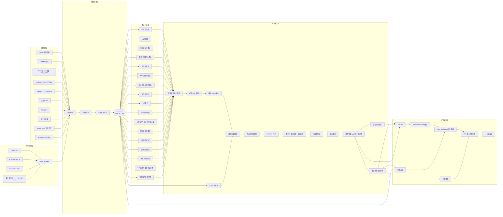
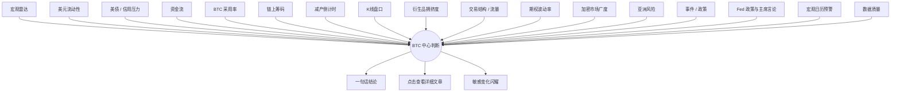
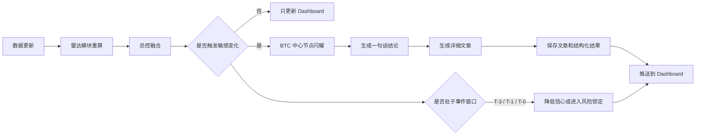

# BTC 短周期趋势感知系统草稿

## 1. 项目定位

本项目是一个面向 BTC 的短周期趋势感知系统。

系统通过自动采集宏观、美元流动性、ETF、链上、衍生品、期权、价格结构、市场宽度和事件数据，结合 LLM 对 evidence + data 的结构化分析，判断 BTC 未来 1-5 天的趋势状态、主导驱动、风险变化和可能的拐点。

本系统不做 trade plan，不输出开仓、止损、仓位建议。它的核心目的不是给出交易指令，而是敏感识别：

- BTC 当前是继续走强、走弱、震荡，还是进入高波动状态
- 当前趋势主要由真实资金、宏观环境、杠杆挤压、链上筹码，还是事件冲击驱动
- 趋势是否健康，是否存在衰竭、派发、挤仓或反转风险
- 哪些后续数据会验证或推翻当前判断

最终输出应同时包含结构化 JSON 和可读文章。

## 2. 核心原则

### 2.1 Evidence + Data 优先

每一个判断必须有数据和证据支撑，避免只用主观语言描述市场。

LLM 的职责不是凭感觉预测，而是解释数据、比较证据、识别冲突，并输出结构化结论。

### 2.2 模块独立，最终融合

不同数据模块先独立分析，分别输出自己的方向、强度、信心和风险点。

最后由总控层进行证据融合，形成 BTC 的总体状态判断。

### 2.3 不追求单点预测

系统不预测某个精确价格，而是判断市场状态和趋势环境，例如：

- healthy_uptrend
- leverage_squeeze
- exhaustion
- macro_pressure
- range_accumulation
- distribution
- event_compression

### 2.4 必须包含反证机制

任何结论都必须给出 invalidation signals，也就是哪些数据出现后，当前判断应被削弱或推翻。

### 2.5 数据质量独立评分

数据延迟、缺失、异常值、来源冲突、API 限流和抓取失败都必须进入数据质量模块，避免低质量数据污染最终判断。

### 2.6 所有趋势判断必须对比历史

所有用于趋势判断的数据，都不能只看当前值。

任何雷达模块只要输出 bullish、bearish、neutral、mixed、strength、confidence 或趋势变化，都必须至少参考历史窗口。

最低要求：

- 当前值
- 前一周期值
- 24h 变化
- 3D 变化
- 7D 变化
- 30D 变化
- 移动平均
- Z-score 或分位数
- 连续上升 / 下降天数
- 是否出现异常值
- 是否与 BTC 价格响应一致

目的：

- 避免把单点噪音误判成趋势
- 区分短期波动和结构变化
- 识别背离
- 判断数据是否已经被市场定价
- 提高状态切换的可靠性

### 2.7 算法拉警报，LLM 做推理

系统的趋势敏感感知不应完全依赖 LLM，也不应完全依赖写死规则。

推荐逻辑：

```text
数据 -> 算法检测变化 -> 模块 LLM 推理 -> 总控 LLM 融合 -> Dashboard / 文章
```

算法负责发现变化和拉响警报：

- 变化率
- Z-score
- 历史分位数
- 连续上升 / 下降
- 阈值突破
- 背离
- 异常值
- 事件窗口
- 多模块同向变化

模块 LLM 负责解释本模块证据：

- 判断本模块是 bullish、bearish、neutral 还是 mixed
- 判断信号是噪音还是结构变化
- 解释证据之间是否互相确认
- 识别模块内冲突
- 输出模块级反证条件

模块 LLM 不是自由发挥。它必须在固定框架下，基于 algorithm_alert、historical_features、evidence 和 supporting_data 推理。

模块 LLM 禁止：

- 使用没有数据支持的主观判断
- 编造数据
- 忽略算法检测结果
- 跳过历史窗口
- 直接给最终 BTC 总方向
- 输出交易建议
- 把单点数据当成趋势

总控 LLM 负责融合所有模块：

- 判断哪些模块更重要
- 判断哪些证据互相确认
- 判断哪些证据冲突
- 输出 BTC 总状态
- 输出 direction_bias、confidence、risk_level
- 输出最终反证条件
- 判断是否需要生成文章

原则：

- 算法负责拉响警报
- 模块 LLM 负责局部推理
- 总控 LLM 负责全局推理
- LLM 不直接替代数值阈值和历史统计
- 总控 LLM 不直接读取所有原始数据，而是读取各模块 JSON

### 2.8 预警优先于预测

系统的核心不是预测 BTC 一定会涨或跌，而是尽早发现市场结构变化。

预警目标：

- 发现趋势延续质量变差
- 发现资金流和价格响应背离
- 发现杠杆拥挤和清算风险
- 发现宏观事件进入高敏感窗口
- 发现数据质量不足以支持强判断
- 发现原有判断的反证条件被触发

系统输出的建议应定义为观察建议和风险提示，不是交易建议。

允许输出：

- 需要重点观察哪些数据
- 当前判断为什么需要降信心
- 哪些条件触发后需要重新评估
- 哪些风险正在升温
- 哪些证据还不足

禁止输出：

- 开仓建议
- 止损建议
- 仓位建议
- 杠杆建议
- 具体买卖指令

### 2.9 误报控制与敏感度分级

系统要足够敏感，但不能频繁误报。

所有预警必须有等级：

- info：普通变化，只更新 Dashboard
- watch：进入观察状态，需要持续跟踪
- warning：趋势结构可能变化，BTC 中心节点轻度闪耀
- critical：趋势状态或风险状态显著变化，触发总控重算和文章生成

预警必须支持：

- debounce：短时间内重复触发时合并
- cooldown：同类预警触发后进入冷却期
- confirmation：关键状态切换需要两个以上证据确认
- downgrade：如果后续数据未确认，预警自动降级

原则：

- 单一指标异常最多触发 watch
- 多模块同向变化才可触发 warning
- 状态机确认 + 反方审查通过才可触发 critical
- 数据质量差时禁止 critical

## 3. 总体架构

系统技术架构建议采用：

- 前端：Vue3
- 后端：FastAPI
- 运行层：Python CLI
- 调度层：异步任务
- 数据更新：默认每 10 分钟更新一次，可按数据源单独配置频率
- 展示形态：单一 Dashboard 大面板

产品形态不是多页面后台，而是一个围绕 BTC 状态展开的实时观察面板。

Dashboard 中间是 BTC 当前判断，周围是不同数据源和分析模块。相关性强的数据源在视觉上聚成一组，整体像拓扑图一样展示市场结构。

系统建议拆成一组可独立运行的雷达层，每个雷达层负责一类市场证据，最后由总控层统一融合。

### 3.x P4.5 轻量研究写作层重构方向

P4.5 是新增在 P3 与 P5 之间的轻量研究写作层，用来替代 P4 中过重的 Agent、交叉质询、Judge 和 Adversarial Review 链路。

Legacy 说明：本文档中旧 P4、模块 LLM、总控 LLM、多 LLM 讨论、交叉质询、Judge、Adversarial Review 等章节保留为历史设计和调试参考，不再作为新的生产主线继续扩展。新的生产实现以 P3-C16 指标级正/零/负评分契约和 P4.5 Radar Scored Analyst Writer 为准。

新的原则是：

```text
P3 负责量化打分
P4.5 负责解释和写作
```

P3 必须先把每个 Radar 指标量化为正分、零分、负分或不可用，并输出指标一句话解释、评分原因、历史上下文和数据质量。P4.5 不再重新裁判指标方向，只消费 P3 已经整理好的 scored evidence。

P4.5 保留 4 个分析员，但取消 LLM 之间的辩论：

- 宏观事件分析员：macro_radar、treasury_credit、asia_risk、event_policy。
- 流动性资金流分析员：dollar_liquidity、fund_flow、crypto_breadth。
- 微观结构分析员：kline_orderflow、derivatives_crowding、trade_structure_flow、options_volatility。
- 链上结构分析员：btc_total_state、btc_adoption、onchain_valuation。

每个分析员只读取自己负责的 Radar Evidence Pack，输出一篇专业中文评论。最终 Writer 汇总 4 篇评论，输出总研究文章。文章必须引用 evidence_id，解释正分、负分、零分和数据边界，但禁止输出交易指令。

P4.5 的目标不是“让 LLM 自由判断市场”，而是让 LLM 在明确的指标评分、指标解释和写作框架下，把数据转化为有洞察的人类可读研究评论。

### 3.1 宏观环境层

目标：判断 BTC 当前处在宏观顺风、逆风还是中性环境。

关注指标：

- DXY
- 美债 2Y / 10Y / 30Y
- Real Yield
- Breakeven Inflation
- VIX
- MOVE
- OFR FSI
- Nasdaq
- Gold
- Oil
- USDJPY
- JGB
- USDCNH
- Nikkei / TOPIX
- HIBOR

核心问题：

- 美元是否走强
- 实际利率是否压制风险资产
- 波动率是否上升
- 美债市场是否存在压力
- 亚洲风险是否正在外溢到 BTC

### 3.2 美元流动性层

目标：判断美元系统流动性是否支持风险资产。

关注指标：

- Fed Balance Sheet
- Bank Reserves
- TGA
- ON RRP
- QT / QE
- SOFR / Repo
- Treasury General Account 变化
- 美元流动性代理指标

核心问题：

- 系统流动性是在扩张还是收缩
- 风险资产是否处在流动性顺风
- 流动性变化是否可能滞后影响 BTC

### 3.3 资金流层

目标：判断 BTC 是否有真实增量资金流入。

关注指标：

- BTC ETF Flow
- ETF AUM
- CME Open Interest
- Stablecoin Supply
- Stablecoin Exchange Inflow
- Exchange Netflow
- Coinbase Premium
- Spot Volume
- Binance / OKX / Bybit / Gate 等主要交易所现货数据

核心问题：

- 上涨是否由真实买盘推动
- ETF 是否持续吸收供给
- 稳定币供应是否扩张
- 交易所净流入是否暗示卖压
- CME 是否代表机构资金参与增强

### 3.3.1 ETF Flow 历史分析层

目标：ETF Flow 不只看当天净流入，而是观察过去多个时间窗口的持续性、趋势、集中度和价格响应。

关注指标：

- Daily Net Flow
- 3D Net Flow
- 7D Net Flow
- 14D Net Flow
- 30D Net Flow
- Cumulative Net Flow
- ETF AUM
- ETF Volume
- ETF Premium / Discount
- Inflow / Outflow Streak
- 单一 ETF 贡献度
- BlackRock / Fidelity / Grayscale 等主要 ETF 拆分
- GBTC Outflow
- Flow Z-score
- Flow 与 BTC 价格响应
- Flow 与现货成交量响应

核心问题：

- ETF 资金是单日异常，还是连续趋势
- 最近 3D / 7D / 30D 是否显示持续买盘
- 流入是否集中在少数 ETF，还是广泛分布
- GBTC 流出是否抵消其他 ETF 流入
- ETF flow 是否领先、同步或滞后 BTC 价格
- 大额流入后价格是否无法上涨，是否暗示卖压吸收
- 大额流出后价格是否抗跌，是否暗示强承接

典型判断：

- 7D 和 30D 净流入持续为正：结构性买盘增强
- 当日大额流入但 7D 仍弱：单日噪音，不应过度解读
- 连续流入但价格不涨：供给吸收或潜在派发，需要结合链上和盘口
- 连续流出但价格不跌：卖压被吸收，可能有其他买盘承接
- GBTC 大额流出 + 其他 ETF 流入不足：ETF 总体偏压制

### 3.3.2 BTC 采用率层

目标：判断 BTC 的长期采用趋势是否在改善，用于衡量结构性需求和宏观叙事强度。

关注指标：

- 活跃地址数
- 新增地址数
- 非零余额地址数
- 持币地址增长
- 闪电网络容量
- 闪电网络节点数
- BTC ETF 持有人或机构参与度
- 公司或主权资产负债表采用
- 支付、托管、清算、交易基础设施采用
- 地区性采用趋势
- 搜索热度
- 开发者活跃度

核心问题：

- BTC 采用率是在持续增长、停滞，还是回落
- 采用增长来自散户、机构、支付网络，还是储备资产叙事
- 采用率是否和价格上涨形成正反馈
- 采用率改善是否能支撑中长期估值
- 采用率数据是否只是噪音，还是出现结构性变化

### 3.4 杠杆与衍生品层

目标：判断当前价格变化是否由杠杆推动，以及是否存在挤仓或去杠杆风险。

关注指标：

- Perp Funding
- OI Change
- Perp Basis
- Futures Basis
- Long / Short Ratio
- Liquidation Zone
- Liquidation Heatmap
- CME Futures Basis
- Perp 与 Spot 价格偏离

数据来源可优先考虑：

- Coinglass
- Binance
- OKX
- Bybit
- Gate
- Huobi / HTX
- CME 相关数据

核心问题：

- Funding 是否过热
- OI 上升是否伴随价格上涨
- 上涨是现货推动还是杠杆推动
- 下方或上方是否存在明显清算磁吸区
- 是否正在形成 short squeeze 或 long squeeze

### 3.4.1 交易结构与链上 / 衍生品流量层

目标：把现货交易结构、链上流量、交易所流量和衍生品流量放在一起观察，判断 BTC 当前价格变化到底由什么类型的资金和交易行为驱动。

关注指标：

- Spot Volume
- Perp Volume
- Futures Volume
- Spot / Perp Volume Ratio
- Buy / Sell Aggressor Volume
- Order Book Depth
- Bid / Ask Imbalance
- Coinbase Premium
- Korea Premium
- Exchange Inflow
- Exchange Outflow
- Exchange Netflow
- Large Transfer Count
- Whale Exchange Flow
- Stablecoin Exchange Inflow
- Stablecoin Exchange Outflow
- OI Change
- Funding Change
- Basis Change
- Liquidation Flow

核心问题：

- 当前价格变化是现货推动，还是衍生品推动
- 现货成交和永续成交是否互相确认
- 链上流入交易所是否意味着潜在卖压
- 稳定币流入交易所是否意味着潜在买盘
- 鲸鱼转账是否和交易所流量、盘口变化同步
- OI 上升时，现货是否同步放量
- Funding 升温时，价格是否仍有真实买盘支撑
- 清算流量是否正在主导短线波动

典型判断：

- 现货成交放大 + ETF/稳定币流入 + OI 温和上升：健康买盘
- Perp 成交放大 + OI 快速上升 + Funding 升高：杠杆推动
- Exchange Inflow 上升 + 价格反弹无量：潜在派发
- Stablecoin Inflow 上升 + 盘口买盘增强：潜在买盘准备
- 清算流量主导 + 现货不跟随：短线噪音或挤仓行情

### 3.5 链上估值与筹码层

目标：判断 BTC 当前价格相对链上成本、盈利盘和持仓结构的位置。

关注指标：

- MVRV
- Realized Price
- SOPR
- STH Cost Basis
- LTH Cost Basis
- Whale Flow
- Miner Flow
- Exchange Reserve
- Exchange Inflow / Outflow
- Long-term Holder Supply
- Short-term Holder Supply

核心问题：

- 当前价格是否进入过热估值区
- 短期持有者是否有盈利兑现压力
- 长期持有者是否开始派发
- 矿工或鲸鱼是否有明显转入交易所行为
- 筹码结构是吸筹、持有，还是派发

### 3.5.1 BTC 减产周期层

目标：跟踪 BTC 下一次减产倒计时，把长期供给周期作为市场背景变量。

关注指标：

- 当前区块高度
- 下一次减产区块高度
- 距离减产剩余区块数
- 预计减产日期
- 当前区块奖励
- 减产后区块奖励
- 平均出块时间
- 距离减产剩余天数

当前已知规则：

- BTC 每 210,000 个区块发生一次减产
- 下一次减产发生在区块高度 1,050,000
- 当前区块奖励为 3.125 BTC
- 下一次减产后区块奖励为 1.5625 BTC
- 预计日期需要根据实时区块高度和平均出块时间动态计算

核心问题：

- 减产距离当前市场是否足够近，是否开始影响叙事
- 矿工收入压力是否随减产临近而上升
- 减产叙事是否和 ETF、流动性、宏观环境形成共振
- 减产是否应进入 Dashboard 的事件预警窗口

### 3.6 价格结构层

目标：用 K 线和技术结构确认最终市场状态。

关注指标：

- BTC 当前价格
- 1H / 4H / 1D K 线
- EMA
- RSI
- MACD
- Volume
- VWAP
- Support / Resistance
- Trendline
- Volatility Compression
- Breakout / Breakdown

核心问题：

- BTC 是否维持趋势结构
- 是否出现放量突破或放量跌破
- 是否背离
- 是否处在震荡压缩区
- 技术结构是否确认其他模块的判断

### 3.7 期权波动率层

目标：判断市场对未来波动和尾部风险的定价。

关注指标：

- IV
- RV
- IV / RV Spread
- Skew
- Put / Call Ratio
- Gamma Wall
- Max Pain
- Options Expiry
- Dealer Gamma Exposure

核心问题：

- 市场是否在定价大波动
- 上行或下行保护需求是否异常
- 临近期权到期是否可能压制或放大波动
- Gamma 位置是否影响价格磁吸

### 3.8 市场宽度层

目标：判断 BTC 的走势是否得到整个加密市场确认。

关注指标：

- ETH/BTC
- TOTAL2
- BTC Dominance
- Top 50 强弱
- 板块热度
- 山寨币广度
- DeFi / AI / Meme / Layer1 / Layer2 等板块轮动

核心问题：

- BTC 上涨是单独吸血，还是市场整体 risk-on
- ETH/BTC 是否确认风险偏好
- BTC Dominance 上升是避险，还是主升阶段
- 山寨币是否出现跟随或背离

### 3.9 事件与政策层

目标：识别未来几天可能改变趋势状态的事件冲击。

关注事件：

- CPI
- PCE
- NFP
- ISM
- Retail Sales
- FOMC
- Powell Speech
- Treasury Refunding
- Treasury Auction
- 监管新闻
- ETF 相关事件
- 地缘政治风险
- 交易所风险事件

核心问题：

- 是否有高影响事件临近
- 市场是否正在事件前压缩波动
- 事件结果可能影响哪些模块
- 当前判断是否需要因为事件风险而降低信心

### 3.10 数据质量与系统健康层

目标：监控数据是否可靠，避免错误输入导致错误判断。

关注内容：

- 数据延迟
- 数据缺失
- 异常值
- 来源冲突
- WebSocket 状态
- API 限流
- Playwright 抓取失败
- 数据更新时间
- 数据源优先级

核心问题：

- 当前数据是否足够新鲜
- 是否存在关键模块缺失
- 不同来源是否冲突
- 是否需要降低最终信心

### 3.11 美债 / 信用压力层

目标：把美债期限结构、实际利率、通胀预期、信用利差和国债发行压力单独作为一个雷达，而不是全部混在宏观环境里。

关注指标：

- 2Y
- 10Y
- 30Y
- Real Yield
- Breakeven
- MOVE
- HY Spread
- TIC
- Treasury Auction

核心问题：

- 美债收益率是否正在压制风险资产
- 实际利率是否对 BTC 形成估值压力
- 信用利差是否显示风险偏好恶化
- MOVE 是否提示债券波动率冲击
- TIC 和 Treasury Auction 是否显示美元资产需求变化
- 美债供给压力是否可能传导到 BTC

### 3.12 亚洲风险层

目标：识别亚洲市场、日元、日债、离岸人民币、港股科技和港元流动性对 BTC 的外溢影响。

关注指标：

- USDJPY
- JGB
- Nikkei
- TOPIX
- USDCNH
- 恒生科技
- HIBOR

核心问题：

- 日元波动是否引发全球风险资产去杠杆
- 日债收益率是否影响套息交易和美元流动性
- 离岸人民币是否显示亚洲风险偏好变化
- 港股科技是否代表亚洲 risk-on / risk-off
- HIBOR 是否显示港元流动性紧张

### 3.13 宏观事件冲击层

目标：对 CPI、PCE、NFP、ISM、Retail Sales、Powell、Treasury Refunding 等事件做事件前、事件中、事件后的冲击分析。

关注事件：

- CPI
- PCE
- NFP
- ISM
- Retail Sales
- Powell
- Treasury Refunding

核心问题：

- 事件前市场是否进入风险锁定
- 实际值相对预期是否产生 surprise
- surprise 对 DXY、美债、Nasdaq 和 BTC 的方向影响是什么
- 事件后是否需要立即触发总控层重新融合
- 是否需要自动生成新文章

该层必须包含事件倒计时预警机制。对于 CPI、PCE、NFP、FOMC 等高影响事件，系统应在事件发布前 7 天、3 天、1 天、发布当天和发布后 1 天分别更新风险状态。

预警阶段：

- T-7：事件进入观察窗口
- T-3：事件风险升温，开始降低趋势判断信心
- T-1：进入事件前锁定状态，避免过度解读短线波动
- T-0：事件发布当天，启动高频监控
- T+1：事件后重新定价观察，评估市场是否确认新方向

### 3.14 Fed 政策与主席言论层

目标：把美联储政策路径、FOMC 成员讲话、主席交接和新主席政策倾向作为独立高优先级雷达。

截至 2026-05-19，美联储官网显示：Powell 在 2026-05-15 被任命为 chair pro tempore，并将在 Kevin M. Warsh 宣誓就任新主席前临时担任主席。因此系统需要同时跟踪 Powell 临时主席阶段的表态，以及 Warsh 作为新主席的讲话、访谈、听证、文章和政策信号。

关注内容：

- FOMC 声明
- FOMC Minutes
- SEP 点阵图
- Fed Chair Press Conference
- Powell 临时主席阶段讲话
- Kevin M. Warsh 新主席讲话
- 新主席听证、访谈、文章和政策表态
- Vice Chair / Governors 讲话
- Regional Fed Presidents 讲话
- Fed Watch / 利率期货隐含概率
- 市场对降息、暂停、加息路径的重新定价

核心问题：

- 新主席言论是否改变市场对利率路径的预期
- 美联储反应函数是否发生变化
- 政策语气是 hawkish、dovish，还是 neutral
- 市场是否重新定价降息次数和时间
- 美债、DXY、Nasdaq 和 BTC 是否同步响应
- 主席交接是否带来政策不确定性溢价

输出标签：

- fed_tone: hawkish / dovish / neutral / mixed
- chair_transition_risk: low / medium / high
- rate_path_repricing: easing / tightening / unchanged / conflicting
- btc_policy_impact: bullish / bearish / neutral / mixed

## 4. 数据来源设想

### 4.0 指标覆盖矩阵

下面是第一版必须覆盖的雷达与指标清单。后续实现时，每个指标都应有独立的数据源、更新时间、数据质量状态和模块归属。

#### 4.0.1 BTC 总状态

目标：给 Dashboard 中心 BTC 节点提供最核心的摘要状态。

必须覆盖：

- 当前价格
- 24h 涨跌
- 减产倒计时
- 下一次减产区块高度
- 当前区块高度
- 核心状态
- 最终方向
- 交易许可
- 风险等级
- 信心等级
- 最近更新时间

说明：

交易许可不是交易建议，而是系统状态标签，用于表达当前环境是否适合继续跟踪趋势。例如：

- allowed
- cautious
- blocked
- event_locked
- data_unreliable

减产倒计时用于展示 BTC 长周期供给节奏。下一次减产预计发生在区块高度 1,050,000，区块奖励将从 3.125 BTC 降至 1.5625 BTC。具体日期需要根据实时区块高度和平均出块速度动态估算。

#### 4.0.2 宏观雷达

目标：判断 BTC 是否处在宏观顺风、逆风或中性环境。

必须覆盖：

- DXY
- 美债
- VIX
- OFR FSI
- Nasdaq
- Gold
- 日元
- 日债
- 石油

数据源优先级：

- OFR FSI：优先从 OFR 官方抓取
- 其他宏观指标：优先 FRED API
- FRED 没有或延迟较大的指标：使用 TradingView 页面抓取，当前不假设有可用 TradingView API

#### 4.0.3 美元流动性雷达

目标：判断美元系统流动性是否支持风险资产。

必须覆盖：

- Fed Balance Sheet
- Bank Reserves
- TGA
- ON RRP
- QT / QE
- SOFR / Repo

数据源优先级：

- FRED API
- Federal Reserve 官方数据
- Treasury 官方数据
- 备用：TradingView 页面抓取或其他官方页面抓取

#### 4.0.4 美债 / 信用压力雷达

目标：判断利率、信用和美债市场压力是否正在影响 BTC。

必须覆盖：

- 2Y
- 10Y
- 30Y
- Real Yield
- Breakeven
- MOVE
- HY Spread
- TIC
- Treasury Auction

数据源优先级：

- FRED API
- Treasury 官方数据
- TIC 官方数据
- Treasury Auction 官方数据
- MOVE / 部分市场指标可通过 TradingView 页面抓取或其他可靠来源补充

#### 4.0.5 资金流雷达

目标：判断 BTC 是否有真实增量资金流入。

必须覆盖：

- ETF Flow
- CME OI
- Stablecoin Supply
- Exchange Netflow

增强指标：

- ETF AUM
- Coinbase Premium
- Spot Volume
- Stablecoin Exchange Inflow

ETF Flow 必须做历史窗口分析，不能只看当前值。

ETF Flow 必须覆盖：

- etf_flow_1d
- etf_flow_3d
- etf_flow_7d
- etf_flow_14d
- etf_flow_30d
- etf_cumulative_flow
- etf_aum
- etf_volume
- etf_premium_discount
- etf_inflow_streak_days
- etf_outflow_streak_days
- etf_flow_zscore
- gbtc_flow
- ibit_flow
- fbtc_flow
- other_etf_flow
- etf_flow_concentration
- etf_flow_price_response
- etf_flow_spot_volume_response

ETF Flow 输出标签：

- etf_flow_trend: strengthening / weakening / stable / reversing
- etf_flow_persistence: one_day_noise / short_streak / persistent / exhausted
- etf_flow_quality: broad_based / concentrated / gbtc_distorted / unclear
- etf_price_confirmation: confirmed / absorbed / diverging / unclear

#### 4.0.5.1 BTC 采用率雷达

目标：衡量 BTC 的中长期采用趋势，作为结构性需求和宏观叙事指标。

必须覆盖：

- active_addresses
- new_addresses
- non_zero_balance_addresses
- address_growth_rate
- lightning_network_capacity
- lightning_network_nodes
- institutional_adoption_events
- corporate_treasury_adoption
- sovereign_or_policy_adoption
- search_interest

增强指标：

- ETF holder count
- ETF institutional ownership
- merchant_payment_adoption
- custody_infrastructure_growth
- developer_activity
- GitHub activity
- regional_adoption_index
- app_downloads_or_wallet_usage

数据源优先级：

- 链上数据平台
- mempool.space / Bitcoin 节点相关数据
- Lightning Network 公开数据源
- ETF 官方披露和 13F
- 公司公告和监管文件
- Google Trends
- GitHub
- 可靠新闻源作为补充

分析重点：

- 采用率是趋势性增长还是短期噪音
- 地址增长是否伴随真实交易活动
- ETF 和机构采用是否扩大 BTC 的可投资人群
- 闪电网络是否显示支付场景采用
- 公司或主权采用是否改变长期叙事
- 搜索热度是否代表散户关注回归

输出标签：

- adoption_trend: rising / falling / flat / mixed
- adoption_quality: organic / speculative / institutional / unclear
- structural_demand_signal: strong / medium / weak
- time_horizon: medium_long

#### 4.0.6 链上估值与筹码雷达

目标：判断 BTC 当前价格相对链上成本、盈利盘和筹码结构的位置。

必须覆盖：

- MVRV
- Realized Price
- SOPR
- STH Cost Basis
- LTH Cost Basis
- Whale Flow
- Miner Flow

增强指标：

- Exchange Reserve
- Exchange Inflow / Outflow
- Long-term Holder Supply
- Short-term Holder Supply

#### 4.0.6.1 BTC 减产倒计时

目标：展示 BTC 下一次减产的实时倒计时，并在接近减产时进入市场叙事和预警系统。

必须覆盖：

- current_block_height
- next_halving_block_height
- blocks_remaining
- estimated_halving_date
- days_remaining
- current_block_reward
- next_block_reward
- average_block_time
- halving_progress

固定规则：

- next_halving_block_height: 1,050,000
- current_block_reward: 3.125 BTC
- next_block_reward: 1.5625 BTC
- halving_interval_blocks: 210,000

数据源优先级：

- Bitcoin Core 节点
- mempool.space API
- blockchain.com API
- CoinGecko / 其他倒计时源作为校验

Dashboard 展示：

- 在 BTC 中心节点显示简短倒计时
- 在链上筹码组显示完整减产节点
- 显示距离减产剩余区块数和预计日期
- 如果估算日期变化较大，标记数据质量或来源差异

预警规则：

- T-365：进入年度减产观察窗口
- T-180：减产叙事观察
- T-90：矿工压力和市场叙事权重提高
- T-30：进入高关注窗口
- T-7：事件观察
- T-1：减产前锁定
- T-0：减产发生，触发总控重新融合和文章生成
- T+7：观察减产后矿工、费用、算力和价格反应

#### 4.0.7 K 线盘口

目标：确认价格结构、趋势强弱和关键位置。

必须覆盖：

- 小时线
- 日线
- EMA
- RSI

增强指标：

- 4H K 线
- MACD
- Volume
- VWAP
- Support / Resistance
- Breakout / Breakdown
- Volatility Compression

#### 4.0.8 衍生品拥挤度

目标：判断杠杆拥挤、挤仓和去杠杆风险。

必须覆盖：

- Funding
- OI Change
- Basis
- Liquidation Zone
- Long / Short Ratio

增强指标：

- Liquidation Heatmap
- Perp / Spot Divergence
- CME Futures Basis
- Exchange-level Funding Comparison

#### 4.0.8.1 交易结构与链上 / 衍生品流量雷达

目标：识别 BTC 当前价格变化背后的交易结构，区分现货驱动、杠杆驱动、链上卖压、稳定币买盘和清算流量。

必须覆盖：

- spot_volume
- perp_volume
- futures_volume
- spot_perp_volume_ratio
- buy_sell_aggressor_volume
- order_book_depth
- bid_ask_imbalance
- coinbase_premium
- exchange_inflow
- exchange_outflow
- exchange_netflow
- whale_exchange_flow
- stablecoin_exchange_inflow
- stablecoin_exchange_outflow
- oi_change
- funding_change
- basis_change
- liquidation_flow

增强指标：

- korea_premium
- large_transfer_count
- taker_buy_sell_ratio
- open_interest_by_exchange
- funding_by_exchange
- liquidation_by_exchange
- spot_cvd
- perp_cvd
- order_book_slope

数据源优先级：

- Binance / OKX / Bybit / Gate 交易所 API
- Coinglass
- 链上数据平台
- mempool.space / Bitcoin 节点相关数据
- TradingView 页面抓取
- Coinbase premium 相关数据源

输出标签：

- market_driver: spot_driven / perp_driven / futures_driven / onchain_flow_driven / liquidation_driven / mixed
- flow_pressure: buy_pressure / sell_pressure / balanced / unclear
- leverage_dependency: low / medium / high
- structure_quality: healthy / fragile / crowded / distribution / unclear

关键组合判断：

- spot_volume 上升且 perp_volume 温和：偏健康
- perp_volume 和 OI 快速上升但 spot_volume 不跟：杠杆依赖偏高
- exchange_inflow 上升且 bid_ask_imbalance 转弱：卖压风险上升
- stablecoin_exchange_inflow 上升且 order_book_depth 改善：潜在买盘增强
- liquidation_flow 主导且 OI 快速下降：去杠杆或短线挤仓完成中

#### 4.0.9 期权波动率雷达

目标：判断市场对未来波动和尾部风险的定价。

必须覆盖：

- IV
- RV
- Skew
- Put / Call
- Gamma Wall
- Max Pain
- Options Expiry

增强指标：

- IV / RV Spread
- Dealer Gamma Exposure
- Term Structure

#### 4.0.10 加密市场广度

目标：判断 BTC 的走势是否得到整个加密市场确认。

必须覆盖：

- ETH/BTC
- TOTAL2
- BTC Dominance
- Top50 强弱
- 板块热度

增强指标：

- 山寨币广度
- 板块轮动
- DeFi / AI / Meme / Layer1 / Layer2 强弱

#### 4.0.11 亚洲风险雷达

目标：识别亚洲市场、日元、日债、离岸人民币和港股科技风险对 BTC 的影响。

必须覆盖：

- USDJPY
- JGB
- Nikkei
- TOPIX
- USDCNH
- 恒生科技
- HIBOR

数据源优先级：

- FRED API
- TradingView 页面抓取
- 官方数据源
- 备用页面抓取

#### 4.0.12 事件 / 政策

目标：识别未来几天可能锁定风险偏好或改变趋势状态的政策与监管事件。

必须覆盖：

- CPI / FOMC 倒计时
- 政策新闻
- 监管事件
- 风险锁定状态

风险锁定状态示例：

- no_lock
- event_watch
- pre_event_lock
- post_event_repricing
- regulation_risk

#### 4.0.13 宏观事件冲击引擎

目标：对高影响宏观事件进行事件前、事件中、事件后的冲击分析。

必须覆盖：

- CPI
- PCE
- NFP
- ISM
- Retail Sales
- Powell
- Treasury Refunding

输出内容：

- 事件时间
- 市场预期
- 前值
- 实际值
- surprise 方向
- 对 DXY / 美债 / Nasdaq / BTC 的可能影响
- 事件后是否触发重新融合和发文

#### 4.0.14 Fed 政策与主席言论雷达

目标：专门跟踪美联储政策路径、主席交接、新主席言论和 FOMC 成员表态。

必须覆盖：

- FOMC Statement
- FOMC Minutes
- SEP / Dot Plot
- Fed Chair Press Conference
- Powell 临时主席阶段讲话
- Kevin M. Warsh 新主席讲话
- 新主席听证、访谈、文章、公开发言
- Vice Chair / Governors 讲话
- Regional Fed Presidents 讲话
- Fed Watch / 利率期货隐含概率
- 降息 / 暂停 / 加息路径变化

数据源优先级：

- Federal Reserve 官方网站
- FOMC 官方日历
- FOMC Statement / Minutes / SEP 官方文件
- Fed 官员 speech / testimony 官方页面
- CME FedWatch 或利率期货数据
- 可靠新闻源作为补充

分析重点：

- 讲话语气分类：hawkish / dovish / neutral / mixed
- 与前次讲话相比是否发生政策语气变化
- 是否改变市场对利率路径的定价
- 是否引发 DXY、美债、Nasdaq、Gold、BTC 同步变化
- 主席交接是否造成政策不确定性
- 新主席是否强化或削弱市场对流动性宽松的预期

触发自动汇总和发文的条件：

- 新主席首次正式讲话
- 新主席确认政策框架或通胀目标表态
- FOMC 声明超预期
- 点阵图明显变化
- FedWatch 隐含概率快速重定价
- Fed 讲话导致 DXY / 美债 / Nasdaq / BTC 同时大幅波动

#### 4.0.15 周期性宏观 / Fed 发布日历与预警

目标：把每月、每周、每次 FOMC 周期内固定发布的高影响数据纳入预警系统，提前提示 BTC 面临的宏观事件风险。

必须覆盖的高影响数据：

- CPI
- Core CPI
- PCE
- Core PCE
- NFP
- Unemployment Rate
- Average Hourly Earnings
- Initial Jobless Claims
- ISM Manufacturing
- ISM Services
- Retail Sales
- PPI
- GDP
- FOMC Rate Decision
- FOMC Statement
- Fed Chair Press Conference
- FOMC Minutes
- SEP / Dot Plot
- Beige Book
- Treasury Refunding
- Treasury Auction
- Fed Balance Sheet H.4.1
- Bank Reserves
- ON RRP
- TGA
- SOFR / Repo

预警时间点：

- T-7：事件进入观察窗口
- T-3：事件风险升温，Dashboard 显示黄色预警
- T-1：事件前锁定，降低趋势判断信心
- T-0 before：发布前高敏感状态
- T-0 after：发布后立即记录 actual、forecast、previous 和 surprise
- T+1：观察市场重新定价是否确认
- T+3：评估事件影响是否衰减或形成新趋势

每个事件至少记录：

- event_name
- event_type
- release_time
- importance
- forecast
- previous
- actual
- surprise
- surprise_direction
- affected_modules
- expected_market_impact
- actual_market_reaction
- pre_event_risk_state
- post_event_repricing_state

风险锁定状态：

- no_lock
- event_watch
- pre_event_lock
- release_monitoring
- post_event_repricing
- impact_confirmed
- impact_faded

Dashboard 展示要求：

- 在事件风险组显示未来 7 天高影响事件
- 在 BTC 中心节点旁显示最近一个高影响事件倒计时
- T-3 开始提高视觉提醒
- T-1 显示事件锁定状态
- T-0 发布后自动触发总控层重新融合
- 如果 surprise 较大，自动生成详细文章

自动触发汇总和发文的条件：

- CPI / Core CPI surprise 明显偏离预期
- PCE / Core PCE surprise 明显偏离预期
- NFP、失业率、薪资数据组合出现明显方向
- FOMC 声明或主席发布会语气超预期
- 点阵图改变利率路径
- FedWatch 概率发生快速重定价
- Treasury Refunding 或 Auction 引发美债利率波动
- 事件后 DXY、美债、Nasdaq、BTC 出现同步大幅波动

### 4.1 宏观与流动性数据

- FRED
- OFR FSI 官方数据
- TradingView 页面抓取
- Treasury 官方数据
- Federal Reserve 官方数据
- CME

FRED API Key:

```text
16262c819c652b66883f59e99952ee47
```

### 4.2 加密市场数据

- Binance
- OKX
- Bybit
- Gate
- Huobi / HTX
- Coinglass
- TradingView 页面抓取
- ETF flow 数据源
- 链上数据平台

### 4.3 抓取方式

优先级建议：

1. 官方 API
2. 交易所公开 API
3. 稳定第三方 API
4. Playwright 页面抓取
5. 手动补充或备用源

Playwright 可以用于 TradingView、Coinglass、OFR FSI 等没有方便 API 或 API 受限的来源。

### 4.4 数据源获取方式验证矩阵

数据源选择原则：

1. 能走官方 API 的优先官方 API
2. 宏观与流动性数据优先 FRED API
3. FRED 没有、频率不够或不是目标口径时，优先寻找其他官方 API 或公开 API
4. 交易所、Deribit、CME、Bitcoin 节点等有公开 API 的优先 API
5. TradingView 面向机构的 API 不作为当前默认方案；需要 TradingView 数据时，按页面源处理，使用 Playwright 抓取
6. 没有稳定 API 的页面数据，使用 Playwright 抓取
7. 所有数据源都必须记录 source、method、fallback、last_success_at、data_quality

已用 FRED API 抽样验证通过的核心 series：

| 指标 | FRED series_id | 验证状态 | 说明 |
|---|---:|---|---|
| US 2Y | DGS2 | 可用 | 美债 2 年收益率 |
| US 10Y | DGS10 | 可用 | 美债 10 年收益率 |
| US 30Y | DGS30 | 可用 | 美债 30 年收益率 |
| 10Y Real Yield | DFII10 | 可用 | 10 年 TIPS 实际收益率 |
| 10Y Breakeven | T10YIE | 可用 | 10 年通胀预期 |
| VIX | VIXCLS | 可用 | VIX 日度 |
| Broad USD Index | DTWEXBGS | 可用 | 可作为 DXY 替代；精确 DXY 需 TradingView 页面抓取 |
| Nasdaq Composite | NASDAQCOM | 可用 | Nasdaq 综合指数 |
| WTI Oil | DCOILWTICO | 可用 | WTI 原油 |
| USDJPY | DEXJPUS | 可用 | 日元汇率 |
| Fed Balance Sheet | WALCL | 可用 | Fed 总资产 |
| Bank Reserves | WRESBAL | 可用 | 银行准备金 |
| TGA | WTREGEN | 可用 | 美国财政部一般账户 |
| ON RRP | RRPONTSYD | 可用 | 隔夜逆回购 |
| SOFR | SOFR | 可用 | SOFR |
| HY Spread | BAMLH0A0HYM2 | 可用 | 高收益信用利差 |
| CPI | CPIAUCSL | 可用 | CPI |
| Core CPI | CPILFESL | 可用 | 核心 CPI |
| PCE | PCEPI | 可用 | PCE |
| Core PCE | PCEPILFE | 可用 | 核心 PCE |
| NFP Payrolls | PAYEMS | 可用 | 非农就业人数 |
| Unemployment Rate | UNRATE | 可用 | 失业率 |
| Average Hourly Earnings | CES0500000003 | 可用 | 平均时薪 |
| Initial Jobless Claims | ICSA | 可用 | 初请失业金 |
| Retail Sales | RSAFS | 可用 | 零售销售 |
| GDP | GDP | 可用 | GDP |
| USDCNY | DEXCHUS | 可用 | 在没有 CNH 时可作 CNY 参考 |
| Nikkei 225 | NIKKEI225 | 可用 | 日经 225 |
| Japan LT Rate | IRLTLT01JPM156N | 可用 | 日本长期利率，频率偏低 |

FRED 抽样未通过或不适合作为主源：

| 指标 | FRED 结果 | 推荐主源 | 备用 |
|---|---|---|---|
| Gold Spot | 未找到合适现货金价 series | 官方/公开市场数据源；或 TradingView 页面 | Playwright |
| MOVE | 测试 MOVE series 不可用 | 可靠市场数据源；或 TradingView 页面 | Playwright |
| Exact DXY | FRED 可用的是 broad USD proxy | TradingView TVC:DXY 页面 | Playwright |
| TOPIX | FRED 不作为主源 | TradingView 页面或官方源 | Playwright |
| USDCNH | FRED 只有 USDCNY 更合适 | TradingView USDCNH 页面 | Playwright |
| 恒生科技 | FRED 不覆盖 | TradingView 页面或港交所相关源 | Playwright |
| HIBOR | FRED 不作为主源 | HKAB / 官方页面 | Playwright |

### 4.5 各雷达数据源获取方案

| 雷达 | 指标范围 | 首选来源 | 获取方式 | 备用 |
|---|---|---|---|---|
| BTC 总状态 | 价格、24h、区块高度、减产倒计时 | Binance / OKX / Bitcoin Core | API / 节点 RPC | mempool.space / Playwright |
| 宏观雷达 | DXY、美债、VIX、Nasdaq、Gold、Oil、日元、日债 | FRED 优先 | FRED API | 官方源 / TradingView 页面抓取 |
| OFR FSI | 金融压力指数 | OFR 官方 | 官方下载或页面抓取 | Playwright |
| 美元流动性 | WALCL、WRESBAL、TGA、ON RRP、SOFR | FRED | FRED API | Fed / Treasury 官方 |
| 美债 / 信用压力 | 2Y/10Y/30Y、Real Yield、Breakeven、HY Spread | FRED | FRED API | 官方源 / Playwright |
| MOVE | 债券波动率 | 可靠市场源；或 TradingView 页面 | API / Playwright | Playwright |
| TIC | TIC 资金流 | Treasury 官方 | 官方数据下载 | Playwright |
| Treasury Auction | 国债拍卖 | Treasury 官方 | 官方数据下载 | Playwright |
| ETF Flow | 1D/3D/7D/30D、AUM、GBTC、IBIT、FBTC | ETF flow 数据平台 / 发行商披露 | API 或页面抓取 | Playwright |
| CME OI | CME BTC OI | CME 官方 / Coinglass | API / 页面抓取 | Playwright |
| Stablecoin Supply | USDT/USDC 等供应 | DeFiLlama / 链上平台 | API | Playwright |
| Exchange Netflow | BTC / stablecoin 交易所流入流出 | 链上数据平台 | API | Playwright |
| BTC 采用率 | 活跃地址、非零余额、闪电网络、机构采用 | 链上平台 / Lightning 数据 / Google Trends | API | Playwright |
| 链上估值筹码 | MVRV、SOPR、STH/LTH、鲸鱼、矿工 | Glassnode / CryptoQuant 等 | API | Playwright |
| K 线盘口 | 1H/4H/1D、EMA、RSI、Volume、VWAP | Binance / OKX | API | TradingView 页面抓取 / Playwright |
| 衍生品拥挤度 | Funding、OI、Basis、Long/Short、Liquidation | Binance / OKX / Bybit / Coinglass | API | Playwright |
| 交易结构流量 | Spot/Perp Volume、Order Book、CVD、Liquidation Flow | 交易所 API / Coinglass | API | Playwright |
| 期权波动率 | IV、RV、Skew、Put/Call、Gamma、Max Pain | Deribit / 期权数据平台 | API | Playwright |
| 加密市场广度 | ETH/BTC、TOTAL2、BTC.D、Top50、板块 | CoinGecko / 交易所 / TradingView 页面 | API / Playwright | Playwright |
| 亚洲风险 | USDJPY、JGB、Nikkei、TOPIX、USDCNH、恒生科技、HIBOR | FRED + 官方源 + TradingView 页面 | API / Playwright | Playwright |
| 事件 / 政策 | CPI、FOMC、监管、政策新闻 | 官方日历 / Fed / BLS / BEA | 官方 API / 页面 | Playwright |
| Fed 政策与主席言论 | FOMC、Minutes、Dot Plot、主席讲话、FedWatch | Federal Reserve / CME | 官方页面/API | Playwright |
| 宏观事件冲击 | actual、forecast、previous、surprise | 官方发布源 + 经济日历 | API / 页面抓取 | Playwright |

### 4.6 数据源验证状态字段

每个数据源配置必须包含：

```json
{
  "source_id": "fred_dgs10",
  "name": "US 10Y Treasury Yield",
  "radar": "credit_pressure",
  "preferred_source": "FRED",
  "method": "api",
  "series_id": "DGS10",
  "fallback_source": "TradingView page via Playwright",
  "update_frequency": "1d",
  "requires_playwright": false,
  "validation_status": "verified",
  "last_validation_at": "2026-05-19",
  "last_success_at": null,
  "data_quality": "unknown"
}
```

验证状态枚举：

- verified
- verified_with_proxy
- needs_official_source
- tradingview_required
- playwright_required
- paid_api_likely
- unknown

### 4.7 Playwright 使用边界

Playwright 只作为最后手段，不作为默认抓取方式。

适合使用 Playwright 的场景：

- 数据没有公开 API
- API 需要付费但页面可访问
- TradingView 图表指标需要页面读取；当前不假设可使用 TradingView API
- Coinglass 某些数据无法稳定 API 获取
- 官方页面只有表格下载或动态渲染
- 经济日历页面需要抓取 forecast / actual

不适合使用 Playwright 的场景：

- FRED 已有稳定 API
- 交易所有公开 API
- Deribit、Binance、OKX 等可直接 API
- Bitcoin Core 节点可以直接 RPC
- 官方可下载 CSV / JSON

## 5. 模块标准输出格式

每个模块都应该输出结构化 JSON，避免只输出自然语言。

示例：

```json
{
  "module": "macro_environment",
  "algorithm_alert": {
    "is_sensitive_change": true,
    "trigger_type": "zscore_breakout",
    "trigger_reason": "DXY and US10Y rose together while Nasdaq weakened",
    "trigger_strength": 0.72,
    "detected_at": "2026-05-19T10:00:00Z"
  },
  "signal": "bullish",
  "strength": 0.65,
  "confidence": 0.72,
  "time_horizon": "1-5 days",
  "key_observations": [
    "DXY weakened over the last 24h",
    "Nasdaq remains above short-term trend support",
    "Real yield is stable"
  ],
  "supporting_data": {
    "dxy_change_24h": -0.35,
    "vix": 14.8,
    "us10y_change": -0.04
  },
  "risk_flags": [
    "MOVE index remains elevated"
  ],
  "invalidation_signals": [
    "DXY breaks above recent resistance",
    "US10Y yield rises sharply",
    "Nasdaq loses 4H trend support"
  ],
  "data_quality": "good"
}
```

字段说明：

- module: 模块名称
- algorithm_alert: 算法检测到的敏感变化、阈值突破、异常值或背离
- signal: bullish / bearish / neutral / mixed
- strength: 信号强度，0-1
- confidence: 模块信心，0-1
- time_horizon: 判断周期
- key_observations: 核心观察
- supporting_data: 支撑数据
- risk_flags: 风险提示
- invalidation_signals: 反证条件
- data_quality: 数据质量

模块输出中必须区分：

- algorithm_alert: 由规则、统计、阈值、历史窗口计算得出
- llm_reasoning: 由模块 LLM 根据 evidence + data 对本模块进行解释

模块 LLM 只处理本模块，不直接融合其他模块。

### 5.1 模块 LLM 推理框架

模块 LLM 的职责是对单个雷达模块进行 evidence + data 推理。

它不是自由聊天模型，而是受约束的结构化分析器。

每个模块 LLM 必须按以下顺序推理：

1. 读取本模块原始指标和历史窗口
2. 读取算法检测结果 algorithm_alert
3. 检查数据质量 data_quality
4. 判断当前值相对历史是否异常
5. 判断变化是否有连续性
6. 判断是否与 BTC 价格响应一致
7. 判断模块内部是否存在冲突证据
8. 生成模块级 signal、strength、confidence
9. 生成模块级 risk_flags
10. 生成模块级 invalidation_signals

模块 LLM 的输入必须包含：

```json
{
  "module": "etf_flow",
  "raw_data": {},
  "historical_features": {
    "change_24h": 0,
    "change_3d": 0,
    "change_7d": 0,
    "change_30d": 0,
    "zscore_30d": 0,
    "percentile_90d": 0,
    "streak": 0,
    "btc_price_confirmation": "confirmed / diverging / lagging / unclear"
  },
  "algorithm_alert": {
    "is_sensitive_change": false,
    "trigger_type": null,
    "trigger_strength": 0,
    "trigger_reason": null
  },
  "data_quality": {
    "status": "good / stale / missing / conflicting",
    "missing_fields": [],
    "source_conflicts": []
  }
}
```

模块 LLM 的输出必须包含：

```json
{
  "module": "etf_flow",
  "signal": "bullish / bearish / neutral / mixed",
  "strength": 0.0,
  "confidence": 0.0,
  "evidence_summary": [
    {
      "claim": "7D ETF flow remains positive",
      "data": "etf_flow_7d = 1200 BTC equivalent",
      "interpretation": "supports persistent demand"
    }
  ],
  "conflicting_evidence": [],
  "risk_flags": [],
  "invalidation_signals": [],
  "llm_reasoning": {
    "is_noise_or_structure": "noise / structure / unclear",
    "main_interpretation": "",
    "why_not_opposite": "",
    "confidence_reason": ""
  },
  "data_quality": "good"
}
```

模块 LLM 必须遵守：

- 每个 claim 必须对应 data
- 没有 data 的观点不能进入 evidence_summary
- 如果数据缺失，必须降低 confidence
- 如果算法没有触发敏感变化，LLM 不能强行制造警报
- 如果算法触发敏感变化，LLM 必须解释这个警报是否重要
- 如果证据冲突，signal 优先输出 mixed，而不是强行 bullish 或 bearish
- 模块 LLM 不能输出最终 BTC 状态，只能输出模块状态

模块 LLM 推荐 prompt 结构：

```text
你是 {module_name} 雷达分析器。
你只能基于输入的 raw_data、historical_features、algorithm_alert 和 data_quality 推理。
请判断本模块当前信号方向、强度、信心、冲突证据、风险标记和反证条件。
不要编造数据，不要输出交易建议，不要判断最终 BTC 总方向。
所有结论必须引用 evidence + data。
```

## 6. 历史窗口与趋势检测标准

### 6.1 适用范围

所有会参与趋势判断的数据，都必须进入历史窗口分析。

包括但不限于：

- 宏观指标
- 流动性指标
- ETF Flow
- Stablecoin Supply
- Exchange Netflow
- 链上指标
- Funding
- OI
- Basis
- 期权 IV / Skew
- 市场宽度
- 亚洲风险指标
- FedWatch 概率
- 事件前后市场反应
- BTC 价格结构

### 6.2 每个指标的基础历史字段

每个趋势类指标都建议保存并输出以下字段：

```json
{
  "value": 0,
  "previous_value": 0,
  "change_1h": 0,
  "change_24h": 0,
  "change_3d": 0,
  "change_7d": 0,
  "change_30d": 0,
  "ma_7d": 0,
  "ma_30d": 0,
  "zscore_30d": 0,
  "percentile_90d": 0,
  "up_streak": 0,
  "down_streak": 0,
  "trend": "rising / falling / flat / volatile",
  "trend_strength": 0.0,
  "is_outlier": false,
  "btc_price_confirmation": "confirmed / diverging / lagging / unclear"
}
```

### 6.3 历史窗口

不同数据频率使用不同窗口。

高频数据：

- 5m
- 15m
- 1h
- 4h
- 24h
- 3D
- 7D

适用：

- BTC price
- Funding
- OI
- Basis
- Order Book
- Liquidation Flow
- Spot / Perp Volume

中频数据：

- 24h
- 3D
- 7D
- 14D
- 30D
- 90D

适用：

- ETF Flow
- Exchange Netflow
- Stablecoin Supply
- 链上指标
- 市场宽度
- 采用率

低频宏观数据：

- previous release
- 3M
- 6M
- 12M
- cycle percentile

适用：

- CPI
- PCE
- NFP
- Fed Balance Sheet
- Bank Reserves
- TGA
- ON RRP
- TIC
- Treasury Auction

### 6.4 趋势判断规则

趋势判断不能只依赖当前方向，必须结合：

- 变化率
- 连续性
- 历史分位数
- 异常程度
- 与其他指标的共振
- 与 BTC 价格的响应关系

示例：

- 当前值上升，但仍低于 30D 均值：不能直接判断强趋势
- 当前值大幅上升，但 Z-score 极端：可能是异常值或一次性冲击
- 指标连续 7 天改善，但 BTC 不响应：说明市场可能已经定价，或有其他压制因素
- 指标转弱但 BTC 抗跌：说明有其他承接力量

### 6.5 背离检测

所有关键指标都需要检测是否与 BTC 价格背离。

典型背离：

- ETF Flow 持续流入，但 BTC 不涨
- Funding 快速上升，但 BTC 不涨
- OI 上升，但成交量下降
- DXY 上升，但 BTC 抗跌
- 美债收益率上升，但 Nasdaq 和 BTC 不跌
- Exchange Inflow 增加，但 BTC 不跌
- Stablecoin Inflow 增加，但 BTC 不涨

背离输出：

```json
{
  "divergence_detected": true,
  "divergence_type": "flow_price / leverage_price / macro_price / onchain_price",
  "description": "ETF flow is positive for 7D, but BTC failed to break resistance.",
  "risk_implication": "possible supply absorption or distribution"
}
```

### 6.6 异常值检测

所有指标都需要识别异常值。

判断方法：

- Z-score
- 历史分位数
- 同比 / 环比异常
- 数据源交叉验证
- 是否发生在事件发布窗口

异常值不一定代表趋势，必须单独标记。

```json
{
  "is_outlier": true,
  "outlier_method": "zscore_30d",
  "outlier_value": 2.8,
  "possible_reason": "CPI release shock",
  "use_in_trend_score": false
}
```

### 6.7 趋势类指标最低输出要求

任何雷达模块如果要输出趋势判断，必须至少包含：

- current_value
- change_24h 或 previous_release_change
- change_7d 或 rolling_window_change
- trend
- trend_strength
- data_quality
- btc_price_confirmation
- divergence_detected
- is_outlier

没有历史数据的指标，只能作为观察项，不能作为强趋势证据。

## 7. 总控层输出格式

总控层负责融合所有模块，不直接抓数据。

总控层输入是各模块 JSON，而不是全部原始数据。它的职责是全局融合、冲突处理、状态分类和最终表达。

总控层不能只是让 LLM 直接总结所有模块。它必须是一个受约束的控制系统：

```text
模块 JSON
  -> 规则权重融合
  -> 状态机场景匹配
  -> 总控 LLM 全局解释
  -> 反方审查
  -> 最终输出
  -> 事后评分校准
```

目的：

- 防止总控 LLM 成为黑箱
- 防止单个模块噪音导致状态误切换
- 防止忽略冲突证据
- 防止 confidence 虚高
- 防止事件窗口内过度判断方向
- 让系统可以通过回测持续校准

### 7.1 规则权重融合

总控层先对模块 JSON 进行规则化融合。

每个模块必须提供：

- signal
- strength
- confidence
- data_quality
- algorithm_alert
- risk_flags
- conflicting_evidence

总控层按模块权重、市场阶段和数据质量计算初步融合结果。

基础权重示例：

```json
{
  "macro_environment": 0.12,
  "usd_liquidity": 0.10,
  "credit_pressure": 0.10,
  "fund_flow": 0.14,
  "etf_flow": 0.12,
  "derivatives": 0.10,
  "market_structure_flow": 0.10,
  "price_structure": 0.12,
  "onchain": 0.06,
  "options": 0.05,
  "market_breadth": 0.04,
  "event_policy": 0.05
}
```

权重不是固定不变的。不同市场阶段需要动态调整：

- 宏观冲击阶段：宏观、美债、美元流动性、事件权重提高
- 牛市主升阶段：ETF flow、资金流、价格结构、市场宽度权重提高
- 杠杆拥挤阶段：衍生品、交易结构、清算流量权重提高
- 事件前窗口：事件、期权、Fed、数据质量权重提高，方向信心下调
- 数据质量差：对应模块权重下降

### 7.2 状态机场景匹配

BTC 状态不能随意跳转。

总控层必须使用状态机约束状态变化。

示例状态：

```text
neutral
range_accumulation
healthy_uptrend
leverage_squeeze
exhaustion
distribution
macro_pressure
event_compression
```

状态切换必须满足条件。

示例：

```text
range_accumulation -> healthy_uptrend
条件：价格突破 + 资金流改善 + 杠杆不过热 + 数据质量良好

healthy_uptrend -> leverage_squeeze
条件：价格继续上涨 + OI 快速上升 + Funding 升温 + 现货确认减弱

leverage_squeeze -> exhaustion
条件：价格新高失败 + Funding 高位 + OI 拥挤 + 资金流转弱

exhaustion -> distribution
条件：价格跌破结构 + Exchange Inflow 上升 + 反弹无量 + 链上卖压增加

neutral -> macro_pressure
条件：DXY / 美债 / Real Yield 同步上行 + Nasdaq 承压 + BTC 反弹弱

any_state -> event_compression
条件：CPI / FOMC / NFP / PCE 进入 T-1 或 T-0 高敏感窗口
```

状态机规则：

- 单个模块变化不能直接触发大状态跳转
- 低质量数据不能触发高信心状态切换
- 事件 T-1 / T-0 期间，除非价格和宏观同时确认，否则不输出高 confidence
- 状态切换需要记录触发条件和反证条件

### 7.3 冲突处理规则

总控层必须显式处理冲突证据。

典型规则：

- 资金流 bullish，但宏观 bearish：输出 mixed 或降低 confidence
- ETF 强流入，但 BTC 不涨：标记 absorption_or_distribution
- Funding 高、OI 高，但现货强：输出 uptrend_with_leverage_risk
- Funding 高、OI 高，现货弱：输出 leverage_squeeze_risk 或 exhaustion
- DXY 和美债上行，但 BTC 抗跌：标记 macro_resilience
- 交易所流入增加，但价格不跌：标记 supply_absorption
- 数据质量 stale 或 conflicting：禁止 high confidence
- 事件 T-1：默认降低 direction confidence

### 7.4 总控 LLM 全局解释

总控 LLM 只能在规则权重融合和状态机结果基础上解释。

它负责：

- 解释为什么当前状态成立
- 解释哪些模块是主导驱动
- 解释哪些证据冲突
- 解释为什么不是相反结论
- 生成最终反证条件
- 生成 Dashboard 一句话结论
- 判断是否需要详细文章

总控 LLM 禁止：

- 忽略规则融合结果
- 忽略状态机约束
- 忽略数据质量折扣
- 忽略冲突证据
- 直接基于单个模块给出最终方向
- 输出交易建议

### 7.5 反方审查机制

总控 LLM 输出后，必须经过反方审查。

反方审查可以由规则检查器、另一个 LLM，或规则 + LLM 组合完成。

审查问题：

- 结论是否被 evidence + data 支撑
- 是否忽略了关键冲突证据
- confidence 是否过高
- 是否违反状态机
- 是否把短期噪音当成趋势
- 是否遗漏反证条件
- 是否在事件窗口中过度判断方向
- 是否存在交易建议倾向

审查输出：

```json
{
  "review_passed": true,
  "issues": [],
  "required_changes": [],
  "confidence_adjustment": -0.1,
  "final_allowed": true
}
```

如果审查不通过：

- 降低 confidence
- 改为 mixed / neutral
- 补充冲突证据
- 补充反证条件
- 阻止自动发文，只更新 Dashboard

### 7.6 事后评分与校准

每次总控判断都必须保存，供后续复盘。

保存内容：

```json
{
  "timestamp": "2026-05-19T10:00:00Z",
  "btc_state": "healthy_uptrend",
  "direction_bias": "up",
  "confidence": 0.68,
  "risk_level": "medium",
  "main_drivers": [],
  "conflicting_evidence": [],
  "invalidation_signals": [],
  "price_at_decision": 0,
  "price_after_24h": null,
  "price_after_72h": null,
  "price_after_7d": null,
  "max_drawdown_72h": null,
  "invalidation_triggered": false,
  "score": null
}
```

评分维度：

- 24h 方向是否正确
- 72h 方向是否正确
- 7D 状态判断是否合理
- 最大回撤是否符合风险等级
- 反证条件是否及时触发
- confidence 是否校准
- 哪些模块贡献最大
- 哪些模块产生噪音

校准目标：

- 调整模块权重
- 调整状态机阈值
- 调整事件窗口信心折扣
- 调整 prompt
- 识别长期无效或噪音过大的指标

示例：

```json
{
  "asset": "BTC",
  "time_horizon": "1-5 days",
  "rule_based_fusion": {
    "weighted_score": 0.42,
    "dominant_side": "bullish",
    "data_quality_discount": 0.12,
    "event_window_discount": 0.1
  },
  "state_machine": {
    "previous_state": "range_accumulation",
    "candidate_state": "healthy_uptrend",
    "transition_allowed": true,
    "transition_reasons": [
      "price breakout confirmed",
      "ETF flow remains positive",
      "funding is not extreme"
    ]
  },
  "multi_llm_consensus": {
    "enabled": true,
    "models": [
      "deepseek",
      "qwen",
      "volcengine",
      "kimi"
    ],
    "agreement_score": 0.52,
    "disagreement_level": "medium_high",
    "consensus": "partial",
    "state_votes": {
      "healthy_uptrend": 2,
      "leverage_squeeze": 1,
      "mixed": 1
    },
    "direction_votes": {
      "up": 2,
      "volatile": 1,
      "unclear": 1
    }
  },
  "minority_objection": {
    "exists": true,
    "source_model": "deepseek",
    "objection": "ETF 7D flow remains positive, so downside reversal is not confirmed.",
    "strength": 0.72,
    "accepted_by_judge": true,
    "effect": "confidence_discount"
  },
  "global_algorithm_alert": {
    "is_sensitive_change": true,
    "triggered_modules": [
      "etf_flow",
      "derivatives",
      "price_structure"
    ],
    "trigger_reason": "ETF flow weakened while funding and OI became crowded and BTC lost 4H support",
    "trigger_strength": 0.78
  },
  "btc_state": "healthy_uptrend",
  "direction_bias": "up",
  "confidence": 0.68,
  "trend_sensitivity": "medium_high",
  "main_drivers": [
    "ETF inflow remains strong",
    "Macro environment is not restrictive",
    "Spot demand confirms price strength"
  ],
  "main_view": "Trend remains constructive, but leverage risk is rising.",
  "conflicting_evidence": [
    "Funding is rising",
    "Options skew shows some downside hedging"
  ],
  "risk_level": "medium",
  "adversarial_review": {
    "review_passed": true,
    "issues": [],
    "confidence_adjustment": -0.05,
    "final_allowed": true
  },
  "invalidation_signals": [
    "ETF flow turns negative for 2 consecutive sessions",
    "BTC loses 4H EMA support with rising volume",
    "Funding remains high while spot volume weakens",
    "DXY breaks above recent resistance"
  ],
  "next_watchlist": [
    "Next ETF flow update",
    "DXY and US10Y movement",
    "Funding and OI change",
    "BTC reaction around key support"
  ],
  "what_would_change_the_view": [
    "BTC loses 4H support",
    "ETF flow turns negative for 2 consecutive sessions",
    "Funding remains high while spot volume weakens"
  ],
  "data_quality": {
    "overall": "good",
    "missing_modules": [],
    "stale_modules": [],
    "conflicting_sources": []
  }
}
```

### 7.7 最终输出的建议边界

总控层可以输出观察建议和风险建议，但不能输出交易建议。

允许输出：

- watchlist：接下来需要重点观察的数据
- risk_notes：当前正在升温的风险
- confidence_notes：为什么提高或降低信心
- invalidation_watch：哪些条件会推翻当前判断
- next_update_focus：下一次数据更新重点看什么

禁止输出：

- buy / sell / long / short 指令
- 开仓、止损、止盈、仓位
- 杠杆倍数
- 具体交易计划

### 7.8 多 LLM 总控讨论机制

总控层可以引入多 LLM 讨论，但不能让多个模型自由聊天或简单投票。

目标不是让 DeepSeek、Qwen、火山、Kimi 谁声音大谁赢，而是让它们在同一份 evidence + data 下，从不同角度独立分析、互相质询，并留下可审计的推理摘要。

推荐结构：

```text
模块 JSON + 总控融合结果
  -> 证据包 Evidence Pack
  -> 多 LLM 独立盲审
  -> 结构化观点输出
  -> 交叉质询
  -> 二次修正
  -> 证据评分与一致性检查
  -> 主裁判合成
  -> 反方审查
  -> 最终输出
```

参与模型示例：

- DeepSeek：偏逻辑推理和反证检查
- Qwen：偏结构化归纳和中文表达
- 火山模型：偏快速复核和工程化成本控制
- Kimi：偏长上下文阅读和文章一致性检查

这些角色只是默认分工，不能让模型凭角色偏见改变结论。所有模型必须基于同一份证据包。

### 7.8.1 Evidence Pack

多 LLM 讨论前，系统必须生成统一证据包。

证据包包含：

- 各模块 JSON
- 规则权重融合结果
- 状态机候选状态
- 当前 BTC 状态和上一次状态
- 触发的 algorithm_alert
- 触发的反证条件
- 数据质量摘要
- 事件窗口状态
- 预警等级候选
- 历史窗口摘要

证据包禁止包含：

- 未验证数据
- 没有 source 的指标
- 模型上一次自由发挥的结论
- 任何交易指令

### 7.8.2 第一轮：独立盲审

第一轮中，各 LLM 不能看到其他模型的观点。

每个模型必须输出固定 JSON：

```json
{
  "model": "deepseek",
  "round": 1,
  "btc_state_vote": "healthy_uptrend / leverage_squeeze / exhaustion / macro_pressure / range_accumulation / distribution / event_compression / mixed",
  "direction_bias_vote": "up / down / sideways / volatile / unclear",
  "confidence": 0.0,
  "risk_level": "low / medium / high / critical",
  "top_evidence": [],
  "conflicting_evidence": [],
  "invalidation_focus": [],
  "alert_level_vote": "info / watch / warning / critical",
  "reasoning_summary": "",
  "must_not_publish_reason": null
}
```

要求：

- 每个 top_evidence 必须引用模块字段或具体数据
- 如果证据冲突，必须说明冲突
- 如果数据质量不足，必须降低 confidence
- 不能输出交易建议
- 不能直接采纳其他模型观点

### 7.8.3 第二轮：交叉质询

第二轮中，每个模型可以看到其他模型的结构化输出。

质询目标不是辩赢，而是找错：

- 哪个模型忽略了关键证据
- 哪个模型 confidence 过高
- 哪个模型违反状态机
- 哪个模型把单点异常当成趋势
- 哪个模型没有处理冲突证据
- 哪个模型的结论缺少反证条件

质询输出：

```json
{
  "model": "qwen",
  "round": 2,
  "challenges": [
    {
      "target_model": "kimi",
      "issue_type": "ignored_conflict / overconfidence / weak_evidence / state_machine_violation / data_quality_issue",
      "description": "",
      "evidence_reference": ""
    }
  ],
  "revised_vote": {},
  "confidence_adjustment": -0.1
}
```

### 7.8.4 第三轮：修正与收敛

第三轮中，各模型基于质询结果修正自己的判断。

输出：

```json
{
  "model": "kimi",
  "round": 3,
  "final_vote": {
    "btc_state": "leverage_squeeze",
    "direction_bias": "volatile",
    "confidence": 0.61,
    "alert_level": "warning"
  },
  "changed_from_round_1": true,
  "change_reason": "Accepted challenge that funding and OI risk were underweighted.",
  "remaining_disagreement": []
}
```

### 7.8.5 合成规则

最终结果不能简单少数服从多数。

合成顺序：

1. 先检查硬约束
2. 再检查证据强度
3. 再处理冲突证据
4. 再评估少数派强反证
5. 再计算共识程度
6. 再执行信心折扣
7. 最后由主裁判模型生成最终解释

硬约束优先于 LLM 观点：

- 数据质量是否合格
- 状态机是否允许切换
- 预警规则是否满足多证据确认
- 事件窗口是否要求降信心
- 是否有反证条件触发

如果硬约束不允许，哪怕多个 LLM 观点一致，也不能输出强结论。

合成评分：

```json
{
  "consensus_score": 0.0,
  "evidence_support_score": 0.0,
  "conflict_resolution_score": 0.0,
  "minority_objection_strength": 0.0,
  "state_machine_valid": true,
  "data_quality_valid": true,
  "final_publish_allowed": true
}
```

规则：

- 如果模型多数一致，但证据不足，不能 critical
- 如果少数派提出强反证，必须进入 conflicting_evidence
- 如果状态机不允许切换，不能强行切换
- 如果数据质量差，最终 confidence 必须折扣
- 如果模型分歧大，输出 mixed 或降低 confidence
- 如果多模型一致且证据强，才允许提高 confidence

### 7.8.5.1 多 LLM 分歧处理

多 LLM 观点不一致时，分歧本身就是风险信号。

系统不追求强行统一口径，而是按以下规则处理：

```text
硬约束
  -> 证据强度
  -> 冲突处理
  -> 少数派反证
  -> 共识程度
  -> 信心折扣
  -> 最终状态
```

分歧处理规则：

- 不能简单按多数票决定
- 证据强的少数派可以压过证据弱的多数派
- 如果分歧大，输出 mixed / volatile / unclear
- 如果分歧大，confidence 必须降低
- 如果少数派强反证成立，必须保留 minority_objection
- 如果状态机不允许切换，维持旧状态，但可标记 watch / warning
- 如果 warning 证据强但 critical 不满足，不发强结论，只预警
- 如果数据质量差，confidence 上限为 0.45
- 如果模型分歧大且事件窗口临近，优先 event_compression 或 unclear

分歧程度计算：

```json
{
  "model_agreement": {
    "state_votes": {
      "healthy_uptrend": 2,
      "leverage_squeeze": 1,
      "mixed": 1
    },
    "direction_votes": {
      "up": 2,
      "volatile": 1,
      "unclear": 1
    },
    "agreement_score": 0.52,
    "disagreement_level": "medium_high"
  }
}
```

分歧等级：

- low：模型大体一致，可以正常合成
- medium：保留冲突证据，适度降低 confidence
- medium_high：输出更保守状态，优先 mixed / volatile
- high：不允许强方向结论，只输出观察和预警

少数派强反证判断：

少数派观点即使不是多数，也必须检查：

- 是否引用了真实数据
- 是否指出多数派忽略的冲突证据
- 是否触发反证条件
- 是否符合状态机
- 是否能解释价格和数据背离
- 是否指出数据质量问题

如果少数派满足以上条件，应进入最终输出：

```json
{
  "minority_objection": {
    "exists": true,
    "source_model": "deepseek",
    "objection": "ETF 7D flow remains positive, so downside reversal is not confirmed.",
    "strength": 0.72,
    "accepted_by_judge": true,
    "effect": "confidence_discount"
  }
}
```

最终结论可以分层，而不是只给涨跌：

```json
{
  "final_state": "leverage_squeeze",
  "direction_bias": "volatile_up",
  "confidence": 0.58,
  "risk_level": "medium_high",
  "consensus": "partial",
  "main_view": "trend still up, but leverage risk rising",
  "minority_objection": "ETF 7D flow remains strong, so downside reversal is not confirmed",
  "what_would_change_the_view": [
    "BTC loses 4H support",
    "ETF flow turns negative for 2 sessions",
    "Funding remains high while spot volume weakens"
  ]
}
```

最终规则：

- 硬约束失败：不允许强结论
- 数据质量差：confidence 上限 0.45
- 模型分歧大：输出 mixed / volatile / unclear
- 少数派强反证成立：降低 confidence，并保留 minority_objection
- 多数一致且证据强：允许提高 confidence
- 状态机不允许切换：维持旧状态，但标记 watch / warning
- warning 证据强但 critical 不满足：不发强结论，只预警

### 7.8.6 主裁判与反方审查

主裁判可以是一个固定模型，也可以按任务选择。

主裁判职责：

- 汇总多 LLM 观点
- 解释共识和分歧
- 生成最终 BTC 状态
- 生成观察建议和风险提示
- 生成文章草稿

主裁判之后仍需反方审查。

反方审查职责：

- 检查主裁判是否选择性引用证据
- 检查是否忽略少数派强反证
- 检查是否违反状态机和预警规则
- 检查是否输出交易建议

### 7.8.7 多 LLM 讨论可视化

Dashboard 应展示多 LLM 讨论过程，而不只是最终结果。

可视化内容：

- 每个模型的第一轮独立判断
- 每个模型的 confidence
- 每个模型支持的核心证据
- 每个模型提出的冲突证据
- 模型之间的质询关系
- 哪些模型修正了观点
- 最终共识分数
- 少数派反对意见
- 主裁判采用和拒绝了哪些观点

视觉结构建议：

```text
Evidence Pack
  -> DeepSeek / Qwen / 火山 / Kimi 独立判断卡片
  -> 交叉质询连线
  -> 修正后观点
  -> 共识仪表盘
  -> 主裁判结论
  -> 反方审查
```

Dashboard 节点示例：

```json
{
  "debate_id": "2026-05-19T10:00:00Z",
  "models": [
    {
      "name": "deepseek",
      "state_vote": "leverage_squeeze",
      "confidence": 0.64,
      "changed_after_challenge": false,
      "top_evidence_count": 4
    },
    {
      "name": "qwen",
      "state_vote": "mixed",
      "confidence": 0.58,
      "changed_after_challenge": true,
      "top_evidence_count": 3
    }
  ],
  "consensus_score": 0.71,
  "minority_objection": "ETF 7D flow remains positive, so downside conclusion may be premature.",
  "final_state": "leverage_squeeze",
  "publish_allowed": true
}
```

### 7.8.8 行业经验转化为本项目规则

行业里常见做法包括：

- self-consistency：让模型产生多个独立推理路径，再看一致性
- multi-agent debate：多个模型先独立回答，再互相质询
- LLM-as-judge：使用模型按标准评审输出，但不能作为唯一真相层
- criteria-based evaluation：把评审拆成多个明确标准，而不是给一个总分
- adversarial review：专门让审查器寻找漏洞、遗漏和过度自信

本项目采用的落地原则：

- 先独立，后讨论
- 先证据，后观点
- 先结构化评分，后自然语言解释
- 少数派强反证必须保留
- 不用简单投票决定最终状态
- 全过程可视化和持久化
- 每次多 LLM 讨论都进入事后评分

## 8. 预警系统设计

### 8.1 预警等级

预警分为四级：

- info：普通变化，只更新 Dashboard
- watch：进入观察状态，Dashboard 显示提示
- warning：趋势或风险可能变化，BTC 节点轻度闪耀
- critical：状态切换、反证触发或重大事件冲击，触发总控重算和文章生成

预警 JSON：

```json
{
  "alert_level": "info / watch / warning / critical",
  "alert_type": "trend / risk / event / data_quality / invalidation",
  "trigger_modules": [],
  "trigger_reason": "",
  "supporting_evidence": [],
  "conflicting_evidence": [],
  "watch_next": [],
  "auto_downgrade_condition": "",
  "auto_upgrade_condition": "",
  "created_at": "",
  "cooldown_until": ""
}
```

### 8.2 触发规则

info：

- 单个指标小幅变化
- 数据正常更新
- 事件进入 T-7

watch：

- 单个模块 algorithm_alert 触发
- 指标达到 30D 高分位或低分位
- ETF flow、funding、DXY、OI 等关键指标出现短期转向
- 事件进入 T-3

warning：

- 两个以上模块同向变化
- 模块反证条件触发
- 价格结构和资金流出现背离
- Funding/OI 拥挤且价格响应变弱
- 事件进入 T-1

critical：

- 总控状态机允许状态切换
- 总控反证条件触发
- 重大宏观数据 surprise 明显偏离预期
- FOMC / Fed 主席讲话引发利率路径重定价
- BTC 价格结构破位并得到资金流或杠杆数据确认
- 数据质量严重异常导致当前判断不可用

### 8.3 去抖动与冷却期

为了减少误报，预警系统必须支持去抖动和冷却期。

规则：

- 同一指标在 30 分钟内重复触发，只合并为一次 alert
- 同一模块 warning 触发后，默认冷却 60 分钟
- critical 触发后，默认冷却 120 分钟，重大事件窗口可例外
- 如果后续数据没有确认，alert_level 自动降级
- 如果更多模块确认，alert_level 可以升级

### 8.4 确认机制

关键预警不能只靠单点数据。

confirmation 规则：

- 趋势类 critical 至少需要两个模块确认
- 杠杆风险 warning 至少需要 OI、Funding、价格结构三者中两个确认
- 资金流 warning 至少需要 ETF、Stablecoin、Exchange Flow 中两个确认
- 宏观压力 warning 至少需要 DXY、美债、VIX/MOVE、Nasdaq 中两个确认
- 数据质量差时，任何预警最多 warning，不能 critical，除非是 data_quality critical

### 8.5 预警输出要求

每个预警必须回答：

- 发生了什么
- 为什么重要
- 哪些数据支持
- 哪些数据冲突
- 需要观察什么
- 什么时候自动降级或升级

示例：

```json
{
  "alert_level": "warning",
  "alert_type": "risk",
  "title": "杠杆拥挤风险上升",
  "summary": "Funding 和 OI 同步升高，但现货成交没有同步放大。",
  "supporting_evidence": [
    "funding_zscore_30d = 2.1",
    "oi_change_24h = +8.4%",
    "spot_perp_volume_ratio falling"
  ],
  "conflicting_evidence": [
    "ETF flow 7D remains positive"
  ],
  "watch_next": [
    "BTC 是否继续站稳 4H 结构",
    "现货成交是否补量",
    "funding 是否继续升高"
  ],
  "auto_downgrade_condition": "Funding 回落且 OI 不再上升",
  "auto_upgrade_condition": "BTC 跌破 4H 支撑并伴随 OI 下降"
}
```

### 8.6 预警质量评分

每条预警都需要事后评分，避免系统只追求敏感而忽略准确性。

评分字段：

```json
{
  "alert_id": "",
  "alert_level": "warning",
  "created_at": "",
  "resolved_at": null,
  "btc_price_at_alert": 0,
  "btc_price_after_1h": null,
  "btc_price_after_4h": null,
  "btc_price_after_24h": null,
  "btc_price_after_72h": null,
  "max_adverse_move": null,
  "expected_risk_happened": null,
  "false_positive": null,
  "missed_escalation": null,
  "score": null
}
```

评分目标：

- 预警是否提前出现，而不是事后解释
- 预警方向是否和后续风险一致
- warning 是否及时升级或降级
- critical 是否过度触发
- 哪些模块最容易产生误报
- 哪些组合信号最有效

关键指标：

- precision：触发的预警中有多少真正有效
- recall：真实风险发生前系统是否有预警
- lead_time：预警领先风险发生多久
- false_positive_rate：误报率
- alert_fatigue：重复预警是否过多

系统优化目标：

- warning 要敏感
- critical 要克制
- 误报能降级
- 漏报能复盘
- 每次预警都能解释 evidence + data

## 9. BTC 市场状态分类

系统最终不只输出涨跌，而是输出状态。

### 9.1 healthy_uptrend

健康上涨。

特征：

- ETF 或现货资金持续流入
- Stablecoin supply 扩张
- Funding 不极端
- OI 上升但不过热
- 宏观环境不构成压制
- 价格结构保持多头

### 9.2 leverage_squeeze

杠杆挤压上涨。

特征：

- OI 快速上升
- Funding 快速升高
- 价格急涨
- 现货成交跟随不足
- 清算热力图显示上方或下方存在集中清算区

风险：

- 容易出现急涨急跌
- 一旦价格停滞，杠杆多头可能被反向清算

### 9.3 exhaustion

上涨衰竭。

特征：

- 价格创新高但成交量不足
- ETF flow 或现货买盘减弱
- RSI / 价格结构背离
- SOPR 或 MVRV 显示盈利盘压力
- Funding 偏高

风险：

- 可能进入高位震荡或回撤

### 9.4 macro_pressure

宏观压制。

特征：

- DXY 上行
- 美债收益率或实际利率上行
- VIX / MOVE 上升
- Nasdaq 承压
- BTC 反弹弱于风险资产

风险：

- BTC 容易受到外部风险资产回撤拖累

### 9.5 range_accumulation

震荡吸筹。

特征：

- 价格区间震荡
- 波动率下降
- ETF 或链上流出显示供给被吸收
- Funding 中性
- OI 不过热
- 交易所余额下降

机会：

- 后续可能进入方向选择

### 9.6 distribution

派发或风险释放。

特征：

- 交易所净流入增加
- 鲸鱼或矿工转入交易所
- SOPR 高位
- 价格跌破关键结构
- 反弹成交不足

风险：

- 中短期趋势可能转弱

### 9.7 event_compression

事件前压缩。

特征：

- CPI / FOMC / NFP / PCE 等重要事件临近
- 波动率下降或 IV 上升
- 价格区间收敛
- 方向信号混乱

风险：

- 事件结果可能快速改变趋势状态
- 总体信心应下调

## 10. 反证机制

每次系统输出结论时，都必须给出反证条件。

反证条件不是文章装饰，而是自动重新评估触发器。

反证分两层：

- 模块级反证：推翻或削弱单个雷达模块判断
- 总控级反证：推翻或削弱 BTC 最终状态判断

所有模块都必须支持反证条件检查，包括：

- 宏观雷达
- 美元流动性
- 美债 / 信用压力
- 资金流
- ETF Flow
- BTC 采用率
- 链上估值与筹码
- K 线盘口
- 衍生品拥挤度
- 交易结构与链上 / 衍生品流量
- 期权波动率
- 加密市场广度
- 亚洲风险
- Fed 政策与主席言论
- 宏观事件冲击
- 数据质量

工作流程：

```text
新数据进入
  -> 更新历史特征
  -> 检查模块级反证条件
  -> 触发模块重新推理
  -> 检查总控级反证条件
  -> 重新运行规则权重融合和状态机
  -> 反方审查
  -> 更新 Dashboard / 预警 / 文章
```

模块级反证触发后：

- 降低该模块 confidence
- signal 可从 bullish/bearish 改为 mixed/neutral
- 生成模块级 warning
- 重新提交总控层

总控级反证触发后：

- 重新运行总控融合
- 检查状态机是否允许切换
- BTC 中心节点闪耀
- 生成新的观察建议和风险提示
- 必要时自动发文

示例：

如果系统判断为 bullish continuation，反证条件可能是：

- ETF flow 连续 2 天转负
- BTC 跌破 4H 关键均线并放量
- DXY 突破近期阻力
- Funding 维持高位但价格不再上涨
- OI 快速下降且价格无法恢复

如果系统判断为 bearish pressure，反证条件可能是：

- ETF flow 显著转正
- Stablecoin inflow 增加
- BTC 收复关键阻力位
- DXY 回落
- Nasdaq 风险偏好恢复

反证机制的意义：

- 防止系统固执坚持旧判断
- 让后续观察更清晰
- 方便做历史回测
- 提高文章和 JSON 的实用性

## 11. 最终文章结构

LLM 最终文章建议固定结构：

1. BTC 当前状态一句话
2. 今日主导因子
3. 宏观环境
4. 美元流动性
5. 资金流
6. 杠杆与衍生品
7. 链上估值与筹码
8. 价格结构
9. 期权与波动率
10. 事件风险
11. 未来 1-5 天关键观察点
12. 观察建议与风险提示
13. 当前判断的反证条件
14. 数据质量说明

文章风格要求：

- 不使用夸张预测
- 不输出交易建议
- 每个结论尽量对应数据
- 明确说明冲突证据
- 明确说明信心等级
- 明确说明哪些数据会改变判断
- 建议只能是观察建议和风险提示，不能包含开仓、止损、仓位或杠杆

## 12. Dashboard 产品形态

### 12.1 单一大面板

系统只有一个核心 Dashboard 页面。

这个页面不是传统表格后台，而是一个市场状态拓扑面板：

- 中间是 BTC 当前状态节点
- 周围是宏观、美元流动性、资金流、杠杆、链上、价格结构、期权、市场宽度、事件、数据质量等模块
- 每个模块下面显示自己的关键数据源
- 相关性强的数据源会形成一组
- 数据源和模块之间用连线表达影响关系
- 连线可以根据当前影响方向显示不同状态

中心 BTC 节点需要显示：

- 当前 BTC 状态
- 方向偏向
- 信心等级
- 风险等级
- 减产倒计时
- 最近一次更新时间
- 一句话结论

示例：

```text
BTC: healthy_uptrend
Bias: up
Confidence: 68%
Risk: medium
Halving: 2028-04 est. / 1,050,000
Conclusion: ETF 买盘仍在支撑趋势，但 funding 升温使短线波动风险上升。
```

### 12.2 数据源节点

每个可观察数据源都应该在 Dashboard 上显示为一个节点。

节点至少包含：

- 数据源名称
- 所属模块
- 当前状态
- 最近更新时间
- 数据质量
- 当前信号方向
- 当前信号强度

节点状态示例：

- normal
- updating
- stale
- error
- missing
- conflicting

信号方向示例：

- bullish
- bearish
- neutral
- mixed

### 12.3 拓扑分组

Dashboard 上的数据源应按关系聚合，而不是简单列表。

建议分组：

- 宏观压力组：DXY、US10Y、Real Yield、VIX、MOVE、Nasdaq
- 美元流动性组：Fed Balance Sheet、Bank Reserves、TGA、ON RRP、SOFR
- 资金流组：ETF Flow 1D/3D/7D/30D、ETF AUM、GBTC Flow、Stablecoin Supply、Exchange Netflow、Coinbase Premium
- 采用率组：活跃地址、新增地址、非零余额地址、闪电网络容量、机构采用、公司/主权采用、搜索热度
- 杠杆组：Funding、OI、Basis、Long/Short Ratio、Liquidation Heatmap
- 交易结构组：Spot Volume、Perp Volume、Spot/Perp Ratio、Order Book、CVD、Exchange Flow、Stablecoin Flow、Liquidation Flow
- 链上筹码组：MVRV、SOPR、STH/LTH Cost Basis、Whale Flow、Miner Flow、减产倒计时
- 价格结构组：1H/4H/1D K线、EMA、RSI、Volume、Support/Resistance
- 期权波动率组：IV、RV、Skew、Gamma Wall、Max Pain
- 市场宽度组：ETH/BTC、TOTAL2、BTC Dominance、Top50 强弱
- 事件风险组：CPI、FOMC、NFP、PCE、政策新闻
- Fed 政策组：FOMC Statement、Minutes、Dot Plot、主席发布会、Powell 临时主席讲话、Kevin M. Warsh 新主席讲话、FedWatch
- 宏观日历组：CPI、Core CPI、PCE、Core PCE、NFP、失业率、薪资、ISM、Retail Sales、PPI、GDP、Beige Book、Treasury Refunding、Auction
- 系统健康组：API 状态、抓取状态、WebSocket、数据延迟、异常值

### 12.4 中心 BTC 节点闪耀机制

当系统识别到敏感趋势变化时，Dashboard 中间的 BTC 节点应该出现明显但克制的视觉变化。

触发场景：

- btc_state 发生变化
- direction_bias 发生变化
- confidence 快速上升或下降
- risk_level 升级
- 关键模块从 bullish 转 bearish，或从 bearish 转 bullish
- 反证条件被触发
- 事件风险进入高敏感窗口

视觉表现：

- BTC 中心节点闪耀
- 边框或光晕变色
- 显示简短变化原因
- 给出一句话结论
- 保留最近几次状态变化记录

示例：

```text
趋势敏感变化：healthy_uptrend -> leverage_squeeze
原因：Funding 快速升高，OI 增加，但现货成交没有同步放大。
```

### 12.5 点击查看详细文章

Dashboard 默认只显示简洁结论，避免信息过载。

用户点击 BTC 中心节点后，可以看到完整文章。

详细文章包括：

- 当前状态
- 主导驱动
- 冲突证据
- 模块分析
- 未来 1-5 天观察点
- 反证条件
- 数据质量说明
- 生成时间

文章不是每 10 分钟都生成，而是在触发敏感趋势变化时自动生成，也可以支持手动生成。

### 12.6 多 LLM 讨论可视化

Dashboard 应提供一个“总控讨论过程”视图，让用户知道 DeepSeek、Qwen、火山、Kimi 分别说了什么，以及最终结论为什么被采用。

展示内容：

- Evidence Pack 摘要
- 每个模型的第一轮独立判断
- 每个模型的方向、状态、confidence、alert_level
- 每个模型引用的 top evidence
- 每个模型指出的 conflicting evidence
- 交叉质询关系
- 哪些模型在第二轮或第三轮修正了观点
- 少数派反对意见
- 共识分数
- 分歧等级
- 为什么没有简单按多数票决定
- 少数派反证是否被采纳
- confidence 因分歧被折扣多少
- 主裁判最终采用的观点
- 反方审查结果

视图结构：

```text
证据包
  -> 模型独立判断卡片
  -> 模型质询连线
  -> 修正后观点
  -> 共识评分
  -> 主裁判结论
  -> 反方审查结果
```

交互要求：

- 点击模型卡片，可以查看该模型的 evidence_summary
- 点击质询连线，可以查看 challenge 内容
- 点击少数派意见，可以查看它是否被主裁判采纳
- 点击最终结论，可以查看主裁判合成逻辑
- 点击共识分数，可以查看 state_votes、direction_votes 和 disagreement_level
- 所有讨论记录都要保存，方便事后复盘

注意：

- 前端展示 reasoning_summary，不展示模型不可审计的隐藏推理链
- 展示重点是证据、观点、质询、修正和采纳关系
- 讨论过程用于审计和理解，不代表交易建议

## 12.7 SQLite 数据库与持久化层

系统数据量会持续增长：10 分钟默认采集一次、多数据源多窗口特征、Evidence Pack、多 LLM 讨论、文章、预警、Run Logs、History Replay 都需要可追溯存储。

因此项目必须增加一个独立的 SQLite 持久化 Phase。它是横向基础模块，实际开发顺序放在 Phase 0 之后、Phase 1 之前。

### 12.7.1 数据库定位

SQLite 不是临时缓存，而是 onlyBTC 的本地事实库。

它负责：

- 保存原始数据抓取结果
- 保存标准化指标序列
- 保存数据质量、source health、fallback 记录
- 保存异步任务、Run Once、worker、stage logs
- 保存雷达模块输出 JSON
- 保存算法预警、反证条件、冷却期和升级降级记录
- 保存 Evidence Pack、LLM Debate、主裁判、反方审查
- 保存文章、文章版本和发布状态
- 保存历史快照、Replay 评分和校准备注

它不负责：

- 直接生成交易建议
- 保存密钥明文
- 替代数据源 API
- 替代对象存储保存大文件截图

### 12.7.2 技术选型

默认使用：

- SQLite
- WAL mode
- SQLAlchemy 2.x Async
- aiosqlite
- Alembic migration
- Pydantic / SQLModel 风格 Schema

SQLite 配置建议：

```text
journal_mode = WAL
synchronous = NORMAL
foreign_keys = ON
busy_timeout = 5000
temp_store = MEMORY
```

读多写少场景可以直接使用 SQLite。后续如果需要迁移 PostgreSQL，必须保证 Repository 层不泄露 SQLite 方言。

### 12.7.3 核心表域

数据库按域拆分：

```text
source registry
raw observations
normalized metrics
time-series metric values
data quality
run logs
radar module outputs
algorithm alerts
invalidation conditions
evidence packs
llm debate
judge synthesis
articles
dashboard snapshots
replay scoring
audit logs
```

核心表建议：

```text
sources
source_runs
raw_observations
normalized_metrics
metric_values
data_quality_snapshots
source_health_events
fallback_events
rate_limit_events

runs
run_stages
worker_heartbeats
run_logs

radar_outputs
feature_values
module_json_outputs

algorithm_alerts
alert_events
invalidation_conditions
invalidation_events

evidence_packs
evidence_items
evidence_metric_links

llm_debates
llm_rounds
llm_model_votes
llm_challenges
judge_syntheses
adversarial_reviews

articles
article_versions
article_evidence_links

dashboard_snapshots
snapshot_modules
snapshot_alerts
replay_scores
calibration_notes

audit_logs
```

### 12.7.4 时序数据设计

指标数据统一进入 `metric_values`。

关键字段：

```text
metric_id
source_id
observed_at
ingested_at
value_num
value_text
unit
timeframe
quality_score
is_fallback
raw_observation_id
```

必须建立索引：

```text
(metric_id, observed_at)
(source_id, observed_at)
(timeframe, observed_at)
(metric_id, source_id, observed_at)
```

趋势敏感指标必须保留历史窗口，不允许只保存当前值。

### 12.7.5 JSON 与结构化字段

复杂对象可以保存 JSON，但不能只有 JSON。

规则：

- 检索和过滤需要的字段必须拆成列。
- 原始模块输出可以保存 JSON。
- Evidence、LLM Debate、Alert、Article 必须有结构化索引字段。
- JSON schema 需要版本号。

示例：

```text
radar_outputs.output_json
evidence_packs.pack_json
llm_debates.debate_json
articles.article_json
dashboard_snapshots.snapshot_json
```

同时保留：

```text
state
signal
confidence
alert_level
data_quality
created_at
snapshot_id
run_id
```

### 12.7.6 历史快照

每次完整 pipeline 完成后，必须生成 `dashboard_snapshot`。

snapshot 至少关联：

- run_id
- BTC state
- radar outputs
- active alerts
- evidence_pack_id
- debate_id
- article_id
- data_quality_snapshot_id

History / Replay 只读取 snapshot，不读取当前实时表，避免历史回放被当前数据污染。

### 12.7.7 保留策略与维护

数据会持续增长，需要默认保留策略：

- raw_observations：默认保留 90 天，可配置
- metric_values：核心指标长期保留
- run_logs：详细日志默认保留 30-90 天
- dashboard_snapshots：长期保留
- evidence_packs / debates / articles：长期保留
- playwright screenshots：不放 SQLite，只保存文件路径和元数据

维护任务：

- VACUUM / incremental vacuum
- index analyze
- backup
- archive old raw rows
- export replay package

### 12.7.8 API 查询层

前端不直接访问数据库。

后端必须提供 Repository + Service 层：

- source repository
- metric repository
- data quality repository
- run log repository
- radar repository
- alert repository
- evidence repository
- debate repository
- article repository
- replay repository

Dashboard 查询必须使用面向页面的聚合 API，避免前端拼表。

## 12.8 Path Resolver 路径与资源定位

系统后续需要支持本地开发、打包运行、迁移目录、不同操作系统路径和离线演示数据库，因此必须从工程底座阶段建立统一 Path Resolver。

Path Resolver 不作为独立大 Phase，而是放入 Phase 0。原因：

- 它是全局基础设施，应该早于 SQLite、Playwright、日志、导出、前端静态资源。
- 它的体量不足以成为独立业务 Phase。
- 如果分散到各任务中实现，会导致路径硬编码、打包失败和迁移困难。

### 12.8.1 Resolver 负责什么

统一解析：

- project_root
- app_root
- config_dir
- data_dir
- sqlite_db_path
- cache_dir
- logs_dir
- exports_dir
- screenshots_dir
- playwright_artifacts_dir
- seed_data_dir
- ui_references_dir
- static_assets_dir
- backup_dir

### 12.8.2 路径规则

- 禁止在业务代码中硬编码 `E:\onlyBTC`。
- 禁止使用当前工作目录推断关键资源。
- 所有文件路径必须通过 resolver 获取。
- resolver 必须支持环境变量覆盖，例如 `ONLYBTC_HOME`、`ONLYBTC_DATA_DIR`。
- resolver 必须支持 Windows / macOS / Linux。
- resolver 返回路径时必须使用 `pathlib.Path` 风格。
- 所有目录创建必须集中在 resolver 或 bootstrap 层。

### 12.8.3 与各模块关系

- SQLite 使用 resolver 获取数据库路径、backup 路径和 migration 路径。
- Run Logs 使用 resolver 获取日志目录。
- Playwright 使用 resolver 获取截图和抓取产物目录。
- Article / Replay export 使用 resolver 获取导出目录。
- Vue3 打包产物由 resolver / config 指向 static_assets_dir。
- Seed data 使用 resolver 获取演示数据库和 mock fixtures。

### 12.8.4 打包与移植

打包后系统应能在新机器上通过如下方式运行：

```text
onlybtc/
  app/
  data/
  config/
  logs/
  exports/
  backups/
```

迁移时只需要复制：

```text
config/
data/
exports/
backups/
```

不允许业务逻辑依赖 IDE 当前打开目录。

## 13. 数据更新与异步任务

### 13.1 默认更新频率

每个可观察数据源默认每 10 分钟更新一次。

不同数据源可以配置不同频率：

- 高频数据：价格、funding、OI、basis、exchange netflow，可 1-5 分钟
- 中频数据：ETF flow、stablecoin、链上数据，可 10-60 分钟
- 低频数据：FRED、Fed、Treasury、宏观日度数据，可按发布频率更新
- 事件数据：按日历和事件窗口更新

### 13.2 异步任务模型

后端以 FastAPI 提供 API，Python CLI 负责启动、调度和维护任务。

异步任务建议拆成：

- 数据抓取任务
- 数据清洗任务
- 指标计算任务
- 模块分析任务
- 总控融合任务
- 趋势变化检测任务
- 文章生成任务
- Dashboard 推送任务

每个任务应该有独立状态：

- pending
- running
- success
- failed
- skipped
- stale

### 13.3 自动触发汇总和发文

系统不需要每次数据更新都生成长文章。

只有出现敏感趋势变化时，才自动启动最终汇总和发文流程。

触发条件包括：

- BTC 总状态变化
- 方向偏向变化
- 风险等级变化
- 总信心变化超过阈值
- 主导驱动变化
- 关键反证条件触发
- 多个模块在短时间内同向变化
- 重大事件临近或落地
- BTC 减产进入关键倒计时窗口，或减产事件发生
- CPI、PCE、NFP、FOMC 等事件进入 T-3 / T-1 / T-0 高敏感窗口
- 重要宏观数据 actual 与 forecast 明显偏离
- FedWatch 或利率期货隐含路径快速重定价

触发前必须经过：

- 预警等级判断
- 去抖动检查
- 冷却期检查
- 多证据确认
- 数据质量检查
- 反方审查

触发后流程：

1. 汇总最新模块 JSON
2. 总控层重新融合
3. 生成简单结论
4. Dashboard 中心 BTC 节点闪耀
5. 生成详细文章
6. 保存文章和结构化结果
7. 前端点击 BTC 节点可查看详情

### 13.4 手动触发

Dashboard 应支持手动触发：

- 刷新单个数据源
- 刷新某个模块
- 重新运行总控融合
- 手动生成文章
- Run once：立即完整运行一次全流程

手动触发需要在数据质量模块中记录来源，避免和自动任务混淆。

### 13.5 Run Once 全流程

Run once 是用户手动触发的一次完整分析流程。

它不等待默认 10 分钟调度，而是立即执行：

```text
Run once
  -> 更新可用数据源
  -> 数据清洗与质量检查
  -> 历史窗口与异常检测
  -> 模块 algorithm_alert
  -> 模块 LLM 推理
  -> 模块 JSON 输出
  -> 规则权重融合
  -> 状态机匹配
  -> Evidence Pack
  -> 多 LLM 总控讨论
  -> 主裁判合成
  -> 反方审查
  -> 预警等级判断
  -> Dashboard 更新
  -> 必要时生成文章
```

Run once 适用场景：

- 用户刚打开 Dashboard，想立即获取当前状态
- 重大事件前后，用户想手动重算
- 数据源恢复后，需要补一次完整判断
- 用户修改配置后，需要验证系统输出
- 定时任务间隔内，用户想主动刷新

Run once 输出：

- 最新 BTC 中心状态
- 所有模块最新 JSON
- 总控融合结果
- 多 LLM 讨论记录
- 预警等级
- 观察建议和风险提示
- 数据质量报告
- 是否生成文章

Run once 规则：

- Run once 也必须遵守数据质量检查
- Run once 也必须遵守状态机和反方审查
- Run once 也必须记录 source = manual_run_once
- Run once 不应绕过交易建议限制
- 如果数据没有变化，可以只更新运行时间和数据质量，不强制发文
- 如果触发 warning / critical，可正常触发 BTC 闪耀和文章生成
- 如果处于 cooldown，允许用户查看“本次触发被冷却期抑制”的原因

CLI 示例：

```bash
btc-sense run once
btc-sense run once --force-refresh
btc-sense run once --publish-if-triggered
```

## 14. 前后端职责边界

### 14.1 Vue3 前端

负责：

- 展示拓扑 Dashboard
- 展示数据源状态
- 展示模块信号
- 展示 BTC 中心状态
- 展示趋势变化提醒
- 展示详细文章
- 提供 Run once 全流程触发按钮
- 提供手动刷新和手动生成入口

前端不负责复杂判断逻辑，只展示后端输出的结构化状态。

### 14.2 FastAPI 后端

负责：

- 提供 Dashboard 数据 API
- 提供数据源状态 API
- 提供模块分析结果 API
- 提供总控结果 API
- 提供文章列表和详情 API
- 提供手动触发 API
- 提供 Run once API
- 提供 WebSocket 或 SSE 实时推送

FastAPI 不直接把数据库表暴露给前端。所有页面必须通过聚合 API 读取，聚合 API 从 Service / Repository 层读取 SQLite。

### 14.2.1 页面聚合 API 与 SQLite 对齐

每个 Vue3 页面必须有对应的 FastAPI 聚合接口和 SQLite 数据来源。

| Vue3 页面 | FastAPI 聚合 API | 主要 SQLite 域 | 说明 |
|---|---|---|---|
| Dashboard 主拓扑页 | `GET /api/dashboard/current` | dashboard_snapshots、radar_outputs、algorithm_alerts、llm_debates、data_quality_snapshots | 当前实时总览 |
| BTC Detail Overview | `GET /api/btc/overview` | dashboard_snapshots、radar_outputs、evidence_items、judge_syntheses、invalidation_conditions | 解释当前总控结论 |
| Article 文章页 | `GET /api/articles/{article_id}` / `GET /api/articles/latest` | articles、article_versions、article_evidence_links、evidence_items | 完整中文分析文章 |
| Evidence 证据页 | `GET /api/evidence` / `GET /api/evidence/{evidence_id}` | evidence_packs、evidence_items、evidence_metric_links、metric_values | Claim/Data/Interpretation 审计 |
| LLM Debate 多模型讨论页 | `GET /api/debates/{debate_id}` | llm_debates、llm_rounds、llm_model_votes、llm_challenges、judge_syntheses、adversarial_reviews | 结构化多模型审议 |
| Alerts 预警页 | `GET /api/alerts` / `GET /api/alerts/{alert_id}` | algorithm_alerts、alert_events、evidence_items、invalidation_events | 活跃和历史预警 |
| Invalidation 反证页 | `GET /api/invalidation` | invalidation_conditions、invalidation_events、radar_outputs、alert_events | 判断推翻条件 |
| Data Quality 数据质量页 | `GET /api/data-quality` | data_quality_snapshots、source_health_events、fallback_events、rate_limit_events、module_discounts | 数据可靠性控制台 |
| Run Logs 运行日志页 | `GET /api/runs` / `GET /api/runs/{run_id}` | runs、run_stages、worker_heartbeats、run_logs、retry_records | 全流程运行审计 |
| Source Detail 数据源详情页 | `GET /api/sources/{source_id}` | sources、source_runs、raw_observations、normalized_metrics、source_health_events、fallback_events | 单源排障与验证 |
| Radar Detail 雷达详情页 | `GET /api/radars/{module_id}` | radar_outputs、feature_values、module_json_outputs、evidence_items、source_health_events | 单模块解释页 |
| History / Replay 历史回放页 | `GET /api/replay/snapshots` / `GET /api/replay/{snapshot_id}` | dashboard_snapshots、snapshot_modules、snapshot_alerts、replay_scores、calibration_notes | 历史判断复盘 |

### 14.2.2 前后端契约规则

- Vue3 页面只消费 API DTO，不直接理解数据库表。
- API DTO 字段命名必须与 UI 文档一致，例如 `state`、`confidence`、`alert_level`、`data_quality`。
- 所有聚合 API 必须返回 `snapshot_id` 或 `run_id`，便于跳转 History / Run Logs。
- 所有 Evidence、Alert、Debate、Article、Replay 相关 API 必须支持 id 跳转。
- FastAPI 必须区分 realtime 与 historical mode，History / Replay 不允许读取当前实时状态。
- 写操作必须进入 Run Logs 或 audit_logs。
- 失败响应必须包含 `error_code`、`message`、`source_id/module_id/run_id` 之一，便于 UI 定位。

### 14.3 Python CLI

负责：

- 初始化项目
- 启动服务
- 启动调度器
- 手动运行指定任务
- 检查数据源状态
- 导出历史结果

CLI 示例目标：

```bash
btc-sense serve
btc-sense worker
btc-sense refresh source funding
btc-sense refresh module macro
btc-sense analyze
btc-sense publish
btc-sense run once
```

## 15. 业务流与拓扑图

### 15.1 核心业务流

系统业务流可以概括为：

1. 数据源定期更新
2. 数据清洗和质量检查
3. 各雷达模块独立生成结构化判断
4. 总控层融合所有模块证据
5. 趋势变化检测器判断是否出现敏感变化
6. Dashboard 实时更新
7. 如果触发敏感变化，BTC 中心节点闪耀
8. 自动启动最终汇总和文章生成
9. 用户点击 BTC 中心节点查看详细文章
10. 结果进入历史库，用于后续回测和评分

用户也可以通过 Run once 手动触发同一套全流程。Run once 与定时任务走相同管线，只是触发来源不同。

### 15.1.1 加入 SQLite 后的端到端业务链条

```text
Scheduler / Run Once
  -> runs / run_stages 写入 SQLite
  -> fetch 数据源
  -> raw_observations / source_runs 写入 SQLite
  -> cleaning / normalization
  -> normalized_metrics / metric_values 写入 SQLite
  -> data quality / fallback / rate limit
  -> data_quality_snapshots / source_health_events 写入 SQLite
  -> radar feature calculation
  -> feature_values / radar_outputs / module_json_outputs 写入 SQLite
  -> algorithm alerts / invalidation checks
  -> algorithm_alerts / invalidation_events 写入 SQLite
  -> Evidence Pack
  -> evidence_packs / evidence_items 写入 SQLite
  -> module LLM / multi LLM debate / judge / adversarial review
  -> llm_debates / judge_syntheses / adversarial_reviews 写入 SQLite
  -> final control JSON
  -> dashboard_snapshots 写入 SQLite
  -> FastAPI 聚合 API
  -> Vue3 Dashboard / 子页面展示
  -> article / alert / replay scoring
  -> articles / replay_scores / calibration_notes 写入 SQLite
```

核心原则：

- Pipeline 先写 SQLite，再由 FastAPI 聚合读取。
- Vue3 不直接接触 Pipeline 内部对象。
- History / Replay 只读 snapshot，不读当前实时状态。
- 每个可点击对象都必须能通过 id 追溯到 SQLite 记录。

### 15.1.2 子页面业务流

Dashboard 主拓扑页：

```text
dashboard_snapshots latest
  -> radar_outputs + active alerts + data quality + debate summary
  -> GET /api/dashboard/current
  -> Vue3 topology render
```

BTC Overview：

```text
latest snapshot
  -> judge_synthesis + key radar outputs + conflicting evidence + invalidation conditions
  -> GET /api/btc/overview
  -> Overview drawer/page
```

Article：

```text
article_id/latest
  -> article_versions + evidence links + debate_id + snapshot_id
  -> GET /api/articles/{id}
  -> Article page
```

Evidence：

```text
evidence_pack_id / module_id / evidence_id
  -> evidence_items + metric_values + source health
  -> GET /api/evidence
  -> Evidence audit page
```

LLM Debate：

```text
debate_id
  -> frozen evidence_pack + rounds + challenges + judge + adversarial review
  -> GET /api/debates/{id}
  -> LLM Debate page
```

Alerts：

```text
alert_id / active alerts
  -> alert_events + supporting evidence + conflicting evidence + invalidation links
  -> GET /api/alerts
  -> Alerts operations page
```

Invalidation：

```text
current state / module_id
  -> invalidation_conditions + invalidation_events + trigger distance
  -> GET /api/invalidation
  -> Invalidation page
```

Data Quality：

```text
data_quality_snapshot latest
  -> source health + fallback + rate limits + module discounts
  -> GET /api/data-quality
  -> Data Quality page
```

Run Logs：

```text
run_id / latest running
  -> runs + run_stages + worker_heartbeats + run_logs + retry_records
  -> GET /api/runs/{run_id}
  -> Run Logs page
```

Source Detail：

```text
source_id
  -> sources + source_runs + raw_observations + normalized_metrics + fallback events
  -> GET /api/sources/{source_id}
  -> Source Detail page
```

Radar Detail：

```text
module_id
  -> radar_outputs + feature_values + evidence + invalidation + upstream sources
  -> GET /api/radars/{module_id}
  -> Radar Detail page
```

History / Replay：

```text
snapshot_id
  -> dashboard_snapshots + snapshot_modules + snapshot_alerts + replay_scores
  -> GET /api/replay/{snapshot_id}
  -> Historical mode UI
```

### 15.2 总体业务拓扑



### 15.3 Dashboard 视觉拓扑

Dashboard 的视觉结构以 BTC 为中心，所有雷达围绕 BTC 展开。每个雷达节点都显示当前方向、强度、更新时间和数据质量。



### 15.4 自动发文触发拓扑



### 15.5 业务流关键规则

- 数据源默认每 10 分钟更新一次
- 用户可以通过 Run once 手动完整运行一次全流程
- 高频市场数据可以提高到 1-5 分钟
- 宏观和 Fed 固定发布数据按事件日历更新
- 事件进入 T-3 / T-1 / T-0 时提高预警等级
- 每个雷达只输出结构化 JSON，不直接写最终结论
- 每个雷达先由算法检测变化，再由模块 LLM 解释本模块证据
- 模块 LLM 必须在固定框架下基于 evidence + data 推理，不能自由发挥
- 总控层先做规则权重融合和状态机场景匹配，再由总控 LLM 全局解释
- 总控层可引入 DeepSeek、Qwen、火山、Kimi 等多 LLM 讨论，但必须先独立盲审，再交叉质询，最后由主裁判合成
- 多 LLM 讨论不能简单投票，必须按 evidence support、冲突处理、状态机约束和数据质量评分合成
- 多 LLM 观点不一致时，分歧本身视为风险信号；分歧越大，结论越保守，confidence 越低
- 少数派强反证必须保留，并说明是否被主裁判采纳
- 多 LLM 讨论过程必须可视化和持久化，保留模型观点、质询、修正、少数派反证和最终采纳关系
- 总控输出必须经过反方审查，审查不通过则降低信心、改为 mixed/neutral 或阻止自动发文
- 每次总控判断都要保存，用于 24h/72h/7D 事后评分和权重校准
- 总控 LLM 只读取模块 JSON，不直接读取所有原始数据
- 算法负责阈值、统计、历史窗口、异常值和背离检测
- LLM 负责解释、归因、冲突处理和文字表达
- Dashboard 默认展示简洁状态，不展示长文
- 只有趋势敏感变化、事件冲击或手动触发时才生成详细文章
- BTC 中心节点闪耀代表市场结构变化，不代表交易建议

## 16. 分阶段开发路线

本项目不按简化 MVP 开发，而是按完整系统拆分为多个 Phase。

每个 Phase 都必须能向前承接上一阶段产物，并向后支撑下一阶段能力。阶段之间不能做一次性临时实现，所有数据结构、任务状态、模块 JSON、历史库和审计日志都要从第一阶段开始按最终系统设计。

### 16.0 Phase DoD 与 Mock 测试门禁

每个大 Phase 必须有一个 `Mock / 测试 / DoD` 任务卡。

规则：

- Phase 内核心任务完成后，必须通过本 Phase 的 Mock 与测试任务。
- 未通过 DoD，不允许进入下一个 Phase 的实现。
- Mock 数据必须来自统一 fixtures 或 P8 seed data，不允许每个页面临时手写孤立假数据。
- 测试必须覆盖 happy path、空状态、错误状态、数据质量差、历史模式或失败重试等关键情况。
- 每个 Phase 的 DoD 必须说明产物如何被下一 Phase 消费。

Phase DoD 任务：

```text
P0-C11 工程底座 Mock 与 DoD 验收
P1-C10 数据源 Mock 与 DoD 验收
P2-C15 雷达模块 Mock 与 DoD 验收
P3-C09 预警与反证 Mock 与 DoD 验收
P4-C11 LLM 与总控 Mock 与 DoD 验收
P5-C21 Vue3 页面 Mock 与 DoD 验收
P6-C07 文章回放评分 Mock 与 DoD 验收
P7-C08 生产化校准 Mock 与 DoD 验收
P8-C13 SQLite 数据库 Mock 与 DoD 验收
P9-C13 FastAPI API Mock 与 DoD 验收
```

### 16.1 Phase 0：项目骨架与工程底座

目标：建立完整项目运行骨架，让后续所有模块有统一入口。

交付内容：

- Vue3 前端项目
- FastAPI 后端项目
- Python CLI
- 异步任务框架
- 配置系统
- 日志系统
- Path Resolver 路径与资源定位
- 数据源注册表
- 任务状态表
- 历史结果表
- Dashboard 基础布局

必须支持：

- `btc-sense serve`
- `btc-sense worker`
- `btc-sense run once`
- 手动触发 API
- WebSocket / SSE 推送框架

向后衔接：

- Phase 1 的数据采集任务直接注册到该任务框架
- Phase 2 的雷达模块直接读取统一数据层
- Phase 5 的 Dashboard 直接使用统一 API

验收标准：

- 项目可启动
- CLI 可运行
- 前后端可连通
- resolver 可以解析 config、data、logs、cache、exports、sqlite、screenshots 等目录
- Run once 可以跑空流程并记录任务状态
- Dashboard 能显示系统在线状态
- P0-C11 Mock / 测试 / DoD 通过

### 16.1.1 Phase 8：SQLite 数据库与持久化层

说明：编号为 P8，但执行顺序应放在 Phase 0 之后、Phase 1 之前。它是横向基础 Phase，支撑后续所有数据采集、雷达、预警、LLM、Dashboard 和 History Replay。

目标：

- 建立 SQLite 本地事实库
- 建立 migration、连接管理和 Repository 层
- 建立时序指标、原始数据、标准化数据、数据质量、运行日志、Evidence、LLM Debate、文章、快照、回放评分的核心 Schema
- 让后续 Phase 不再各自临时建表

主要建设内容：

- SQLite WAL、Async SQLAlchemy、Alembic migration
- sources / source_runs / raw_observations / normalized_metrics / metric_values
- data_quality_snapshots / source_health_events / fallback_events / rate_limit_events
- runs / run_stages / worker_heartbeats / run_logs
- radar_outputs / feature_values / module_json_outputs
- algorithm_alerts / alert_events / invalidation_conditions / invalidation_events
- evidence_packs / evidence_items / evidence_metric_links
- llm_debates / llm_rounds / llm_model_votes / llm_challenges / judge_syntheses / adversarial_reviews
- articles / article_versions / article_evidence_links
- dashboard_snapshots / snapshot_modules / snapshot_alerts / replay_scores / calibration_notes
- backup、retention、vacuum、archive、seed demo data

上下衔接：

- Phase 0 提供工程结构、配置系统、异步任务骨架
- Phase 8 接管所有持久化能力
- Phase 1 的数据源接入写入 Phase 8 的 source、raw、metric 表
- Phase 2 的雷达模块读取 Phase 8 的 metric_values 和 feature_values
- Phase 3 的预警与反证写入 Phase 8 的 alert / invalidation 表
- Phase 4 的 Evidence Pack 与多 LLM 讨论写入 Phase 8 的 evidence / debate 表
- Phase 5 的 Dashboard 通过 Phase 8 聚合 API 读取
- Phase 6 的 History Replay 和评分依赖 Phase 8 的 snapshot / replay_scores
- Phase 7 的校准和生产化依赖 Phase 8 的历史评分与审计日志

验收标准：

- 数据库可通过 CLI 初始化、迁移、备份和校验
- Run Once 空流程可以生成 run、run_stage、dashboard_snapshot 的基础记录
- 任意页面需要的核心实体都有稳定表结构或 Repository 接口
- 历史数据、Evidence、Debate、Article、Replay 不会被当前数据覆盖
- 所有写入都带 run_id / snapshot_id / created_at / schema_version 等可追溯字段
- P8-C13 Mock / 测试 / DoD 通过

### 16.2 Phase 1：数据源与历史数据底座

目标：把所有数据接入方式、数据质量、历史窗口和来源验证打通。

交付内容：

- FRED 数据接入
- 交易所 API 接入
- Bitcoin 区块高度 / 减产倒计时接入
- 官方数据源接入框架
- Playwright 页面抓取框架
- 数据源 fallback 机制
- 数据质量评分
- 历史窗口存储
- 数据源验证状态

优先覆盖：

- BTC 价格与 24h 涨跌
- 美债 2Y / 10Y / 30Y
- Real Yield
- Breakeven
- VIX
- DXY proxy
- Fed Balance Sheet
- Bank Reserves
- TGA
- ON RRP
- SOFR
- ETF Flow 数据源框架
- Funding / OI
- Stablecoin Supply
- Exchange Netflow
- 区块高度与减产倒计时

向后衔接：

- Phase 2 的所有雷达只读取该数据层
- Phase 3 的算法检测依赖历史窗口
- Phase 6 的事后评分依赖历史库

验收标准：

- 每个数据源都有 source_id、method、fallback、last_success_at、data_quality
- 趋势类指标至少保存 current、previous、change_24h、change_7d、ma_30d
- FRED 可用指标验证通过
- TradingView 相关数据不假设 API，只通过 Playwright 页面抓取或替代官方源
- 数据缺失时不会导致系统崩溃
- P1-C10 Mock / 测试 / DoD 通过

### 16.3 Phase 2：全量雷达模块

目标：实现完整雷达体系，每个模块都输出统一模块 JSON。

必须实现的雷达：

- BTC 总状态
- 宏观雷达
- 美元流动性雷达
- 美债 / 信用压力雷达
- 资金流雷达
- ETF Flow 历史分析
- BTC 采用率雷达
- 链上估值与筹码雷达
- BTC 减产倒计时
- K 线盘口
- 衍生品拥挤度
- 交易结构与链上 / 衍生品流量雷达
- 期权波动率雷达
- 加密市场广度
- 亚洲风险雷达
- 事件 / 政策雷达
- 宏观事件冲击引擎
- Fed 政策与主席言论雷达
- 周期性宏观 / Fed 发布日历与预警
- 数据质量与系统健康

向后衔接：

- Phase 3 基于模块数据做 algorithm_alert
- Phase 4 基于模块 JSON 做总控融合
- Phase 5 基于模块状态做 Dashboard 拓扑

验收标准：

- 每个雷达有独立 module_id
- 每个雷达输出 signal、strength、confidence、data_quality
- 每个雷达输出 evidence_summary、conflicting_evidence、risk_flags、invalidation_signals
- 没有历史数据的指标只能作为观察项，不能作为强趋势证据
- P2-C15 Mock / 测试 / DoD 通过

P2 全链条验收入口：

```powershell
.\.venv\Scripts\python -m onlybtc.cli p2-full-audit
```

或使用 PowerShell 包装脚本：

```powershell
powershell -ExecutionPolicy Bypass -File scripts\p2-full-audit.ps1
```

如果只复用最新 live 采集数据，不重新采集：

```powershell
powershell -ExecutionPolicy Bypass -File scripts\p2-full-audit.ps1 -NoCollectLive
```

该入口必须同时生成：

- `reports/p1-c22-真实数据全链路验收报告.html`
- `reports/p2-radar-quality-report.html`

P2 独立 Radar 质检报告必须检查：

- `radar_outputs`、`module_json_outputs`、`feature_values` 三表落库数量。
- 每个 radar module 的 `signal`、`strength`、`confidence`、`data_quality`。
- 每个 module 的 `overall_score`、`coverage_score`、`raw_coverage_score`、`source_quality_score`。
- 每个 feature 的 `available`、`source_id`、`quality_score`、`evidence_tier`、`quality_blocking`。
- `missing_metrics` 与 `provider_required_metrics` 必须分开展示，避免后续 provider 缺口误伤核心 radar quality。

### 16.4 Phase 3：算法敏感检测与预警系统

目标：实现系统真正敏感感知能力。

交付内容：

- 历史窗口计算
- Z-score
- 历史分位数
- 连续上升 / 下降
- 异常值检测
- 背离检测
- 模块级反证检查
- 总控级反证检查
- 预警等级 info / watch / warning / critical
- 去抖动 debounce
- 冷却期 cooldown
- 自动升级 / 降级
- 事件 T-7 / T-3 / T-1 / T-0 / T+1 / T+3 预警

向后衔接：

- Phase 4 的模块 LLM 必须读取 algorithm_alert
- Phase 5 的 Dashboard 闪耀机制依赖 alert_level
- Phase 6 的预警质量评分依赖 alert 历史

验收标准：

- 单点异常不会直接触发 critical
- warning 至少需要多证据确认
- 数据质量差时禁止 critical
- 反证触发能自动重新评估
- 每条预警都保存并可回放
- P3-C09 Mock / 测试 / DoD 通过

P3 全链条验收入口：

```powershell
.\.venv\Scripts\python -m onlybtc.cli p3-full-audit
```

或使用 PowerShell 包装脚本：

```powershell
powershell -ExecutionPolicy Bypass -File scripts\p3-full-audit.ps1
```

如果只复用最新 live 采集数据，不重新采集：

```powershell
powershell -ExecutionPolicy Bypass -File scripts\p3-full-audit.ps1 -NoCollectLive
```

该入口必须同时生成本轮对应的三份 HTML：

- `reports/p1-c22-真实数据全链路验收报告.html`
- `reports/p2-radar-quality-report.html`
- `reports/p3-algorithm-audit-report.html`

P3 独立审计报告必须检查：

- P3 pipeline 各阶段写入数量：features、anomalies、divergences、module/global invalidations、event windows、alerts。
- SQLite 契约：`feature_values`、`invalidation_events`、`algorithm_alerts`、`alert_events`。
- run_mode / non_production 状态，确保 live-only 默认输入隔离。
- `not_enough_samples` 必须作为历史长度说明展示，不得误判为链路断点。
- P3 反证必须引用当前 P3 run 的 Radar JSON，不允许读取旧 run 的 module output。

项目管理同步规则：

- 任何新增、优化、修复，都必须同步开发需求、所属 Phase、任务卡和 `task index.md`。
- 新增能力必须新增任务卡；已有能力范围内修复必须追加到对应任务卡执行记录。

### 16.5 Phase 4：模块 LLM、总控融合与多 LLM 讨论

目标：实现 evidence + data 约束下的智能推理和最终判断。

交付内容：

- 模块 LLM 推理框架
- 模块 prompt 模板
- 模块 JSON 审查
- 规则权重融合
- 状态机场景匹配
- Evidence Pack
- DeepSeek / Qwen / 火山 / Kimi 多 LLM 独立盲审
- 交叉质询
- 主裁判合成
- 多 LLM 分歧处理
- 少数派强反证保留
- 反方审查
- 最终总控 JSON

向后衔接：

- Phase 5 展示多 LLM 讨论过程
- Phase 6 对每次总控判断做评分
- Phase 7 根据评分调整权重、prompt 和状态机

验收标准：

- 模块 LLM 不能自由发挥，只能基于 evidence + data
- 总控不能简单按多数票决定
- 状态机不允许时不能强行切换
- 多 LLM 分歧大时自动降低 confidence
- 少数派强反证进入最终 conflicting_evidence
- 反方审查不通过时不能自动发文
- P4-C11 Mock / 测试 / DoD 通过

### 16.6 Phase 5：Dashboard 全量可视化

目标：实现单一大面板和全部子页面，完整展示市场状态、数据源、雷达、预警、多 LLM 讨论、证据审计、运行日志、历史回放和数据质量。

2026-05-21 对齐补充：

P5 必须基于 P1/P2/P3/P4/P8 最新真实链路实现，不再按早期静态 PPT 模式开发。Dashboard 和所有子页面必须共享同一 run context：`collect_run_id`、`p2_radar_run_id`、`p3_run_id`、`evidence_pack_id`、`debate_id`、`judge_synthesis_id`、`snapshot_id`、`run_mode`、`runtime_mode`、`article_runtime_mode`。

P5 页面必须显式展示数据与推理降级状态，包括 `collection_freshness_status`、`business_recency_status`、`feature_run_scope`、`historical_fallback`、`source_resolution`、`fallback_used`、`fallback_reason`、`llm_runtime_integrity`、`agent_runtime_failures` 和 `confidence_cap`。History Replay 只读历史 snapshot；实时推送不得覆盖历史模式。

新增任务卡：P5-C25 P5 全链路契约对齐与 Dashboard 验收基线。

交付内容：

- Vue3 AppShell、路由、状态管理与 API client
- Dashboard 主拓扑页
- BTC Detail Overview
- Article 文章页
- Evidence 证据页
- LLM Debate 多模型讨论页
- Alerts 预警页
- Invalidation 反证页
- Data Quality 数据质量页
- Run Logs 运行日志页
- Source Detail 数据源详情页
- Radar Detail 雷达详情页
- History / Replay 历史回放页
- Run once 按钮和任务进度
- 右侧详情抽屉、全屏子页面、历史模式

上下衔接：

- Phase 8 提供 SQLite 数据基础和 Repository
- Phase 9 提供 FastAPI 页面聚合 API
- Phase 4 负责输出结构化总控、证据和讨论结果
- Phase 6 在 Dashboard 增加回测和评分视图
- Phase 7 在 Dashboard 增加权重和配置管理

验收标准：

- 每个子页面都有独立 Vue3 开发任务
- 每个页面都有对应 FastAPI 聚合 API
- 每个页面都有明确 SQLite 数据来源
- Dashboard 默认展示简洁状态
- 点击 BTC 节点可看 Overview 和 Article
- 点击模型卡片可看 LLM Debate
- 点击 evidence chip 可看 Evidence
- 用户能看到最终结论为什么不是简单投票结果
- Run once 可从前端触发并看到全流程状态
- History / Replay 明确历史模式，不误导为实时状态
- P5-C21 Mock / 测试 / DoD 通过

### 16.6.1 Phase 9：FastAPI 页面聚合 API 与前后端契约

说明：编号为 P9，执行顺序在 P8 之后，并与 P1-P5 并行推进。P9 的职责是把 SQLite Repository 和业务服务包装成 Vue3 页面可直接消费的 API。

目标：

- 建立页面级聚合 API
- 建立 DTO 与错误响应规范
- 建立 SSE / WebSocket 推送
- 建立 Run Once 写入和查询接口
- 建立历史模式 API，保证 replay 不读取实时状态

交付内容：

- Dashboard API
- BTC Overview API
- Article API
- Evidence API
- LLM Debate API
- Alerts API
- Invalidation API
- Data Quality API
- Run Logs API
- Source Detail API
- Radar Detail API
- History / Replay API
- API client DTO schema
- SSE / WebSocket 推送

上下衔接：

- Phase 8 提供 Repository 和 SQLite 表
- P9 面向 Vue3 页面提供稳定 API
- Phase 5 前端只消费 P9 API
- Phase 6/P7 的评分与校准结果也通过 P9 暴露给 UI

验收标准：

- 每个页面都有一个或多个明确 API
- API 返回字段与 UI 文档一致
- API 响应带 snapshot_id / run_id / source_id / module_id 等可追溯 id
- 历史 API 和实时 API 明确分离
- 错误响应能定位到 source_id、module_id、run_id 或 stage_name
- P9-C13 Mock / 测试 / DoD 通过

### 16.7 Phase 6：文章生成、历史记录与回测评分

目标：让系统具备复盘和自我校准基础。

交付内容：

- 自动文章生成
- 手动文章生成
- 文章历史
- 总控判断历史
- 预警历史
- 多 LLM 讨论历史
- 24h / 72h / 7D 结果跟踪
- 预警 precision / recall / lead_time / false_positive_rate
- 状态判断评分
- 反证触发效果评分

向后衔接：

- Phase 7 根据评分做动态权重和阈值优化

验收标准：

- 每次总控判断都能回放当时 evidence pack
- 每条 warning / critical 都能评分
- 能看到哪些模块长期有效，哪些模块噪音大
- 文章不包含交易建议
- P6-C07 Mock / 测试 / DoD 通过

### 16.8 Phase 7：动态校准与生产化增强

目标：让系统从可运行升级为可长期维护、可校准、可扩展。

交付内容：

- 模块权重动态调整
- 状态机阈值校准
- 预警阈值校准
- prompt 版本管理
- 数据源健康监控
- Playwright 抓取稳定性增强
- 成本控制
- 缓存和限流
- 权限和审计
- 配置化新增数据源

验收标准：

- 权重调整有历史评分依据
- prompt 变更可追踪
- 数据源异常可告警
- 任务失败可重试
- 系统可以稳定长期运行
- P7-C08 Mock / 测试 / DoD 通过

### 16.9 Phase 之间的依赖关系

```text
Phase 0 工程底座
  -> Phase 8 SQLite 数据库与持久化层
  -> Phase 1 数据源与历史数据
  -> Phase 2 全量雷达模块
  -> Phase 3 算法敏感检测与预警
  -> Phase 4 LLM 推理与总控融合
  -> Phase 9 FastAPI 页面聚合 API
  -> Phase 5 Dashboard 可视化
  -> Phase 6 回测评分
  -> Phase 7 动态校准与生产化
```

开发原则：

- 不做一次性 demo 结构
- 不跳过数据质量
- 不跳过历史窗口
- 不跳过反证机制
- 不跳过预警评分
- 不让 LLM 绕过算法和状态机
- 每个 Phase 都必须产出可被下一阶段复用的数据结构和 API

## 17. 后续增强方向

### 17.1 回测与评分

保存每日判断结果，后续对比实际走势，评估：

- 方向判断准确率
- 状态识别准确率
- 反证条件触发效果
- 哪些模块最有效
- 哪些模块噪音最大

### 17.2 权重动态调整

不同市场阶段应有不同权重。

例如：

- 牛市主升阶段：ETF flow、stablecoin、现货买盘权重更高
- 宏观危机阶段：DXY、real yield、VIX、MOVE 权重更高
- 高杠杆阶段：funding、OI、liquidation map 权重更高
- 事件前：期权 IV、skew、事件日历权重更高

### 17.3 多模型交叉验证

可以让不同 LLM 分别扮演：

- 宏观分析师
- 链上分析师
- 衍生品分析师
- 技术分析师
- 风控审查员

最后由总控模型融合，并要求风控审查员专门寻找反证和逻辑漏洞。

## 18. 项目目标改写

本项目通过自动采集宏观、流动性、ETF、链上、衍生品、期权、价格结构和事件数据，构建 BTC 短周期趋势感知系统。

系统以 evidence + data 为核心，由多个专业模块分别生成结构化判断，再由总控层进行证据融合，输出未来 1-5 天 BTC 的趋势状态、主导驱动、风险变化、反证条件和数据质量评分。

本系统不提供交易计划，而是用于敏感识别趋势变化、风险拐点和市场结构切换。
## P3-C12 反证语义校准

2026-05-21 起，P3 反证不再只作为通用数据质量门禁，还必须表达业务语义：

- 模块级反证识别 `business_lagging_metrics`、`stale_metrics`、`expired_metrics`、`missing_metrics`、`source_conflicts`、`provider_required_metrics`。
- `business_lagging_metrics`、`stale_metrics`、`missing_metrics` 进入 `near_trigger`；`expired_metrics` 或 low quality 进入 `triggered`。
- `provider_required_metrics` 默认不触发强反证，但必须保留在 evidence 中。
- true source conflict 触发模块反证；suppressed/fallback/definition conflict 只保留解释证据。
- `bullish_state_invalidation` 与 `bearish_state_invalidation` 必须按 Radar signal 方向拆分，不能由同一批模块质量问题同时驱动两边。
- 新增 `run_mode_integrity_invalidation`，当 mixed/mock/test/unknown 历史污染阻断 production critical 时，必须写入 `invalidation_events`，action 为 `block_critical_publish`。
- P3 审计 HTML 必须展示 `reason_code`、`affected_metrics`、`direction_scope`、`quality_impact`、`publish_impact`。

## P4-C12 P4 全链条真实数据契约

2026-05-21 执行收口：

- `scripts/p4-full-audit.ps1` 已补齐，和 CLI `p4-full-audit` 共用同一链条。
- 最新 mock full audit 已生成 P1/P2/P3/P4 四份 HTML。
- 最新 P4 run：
  - `p2_radar_run_id=radar-20260521093118-9ed74d`
  - `p3_run_id=p3-20260521093119-df36d0`
  - `evidence_pack_id=p4-pack-20260521093121-f127e0`
  - `debate_id=debate-fae11f56ca64`
  - `judge_synthesis_id=judge-400a05f88a09`
  - `adversarial_review_id=review-aeb489d44c00`
  - `snapshot_id=snapshot-6d1974686a05`
- `p4-dod-check` 最新结果：`status=passed`、`passed_count=12`、`failed_count=0`。

2026-05-21 起，Phase 4 不再按早期 PPT 式抽象流程实现，必须消费 P1/P2/P3/P8 已落库的真实结构化产物：

```text
P1 data quality + source health
  -> P2 radar module JSON
  -> P3 alerts / invalidations / event windows
  -> Evidence Pack freeze
  -> rule baseline / state machine
  -> 4 Analyst Agents
  -> Cross-examination Agent
  -> Judge Agent synthesis
  -> adversarial review
  -> final controller JSON
  -> dashboard snapshot / history replay
```

P4 采用“自建 P4 Agent 业务编排 + OpenAI Agents SDK 执行层”的混合架构：

- onlyBTC 自建业务编排：Evidence Pack、4 分析师分工、规则基线、状态机、交叉质询、主裁判、反方审查、SQLite 落库和审计 HTML。
- OpenAI Agents SDK 只作为 runtime adapter：负责模型调用、structured output、tracing、guardrails、handoff/as_tool 等执行能力。
- 模型供应商不等同于业务角色。DeepSeek/Qwen/Kimi/OpenAI 等属于 runtime 配置，`macro_event_analyst` 等才是业务角色。

P4 必须对齐以下表：

- 输入：`metric_values`、`data_quality_snapshots`、`radar_outputs`、`module_json_outputs`、`feature_values`、`algorithm_alerts`、`alert_events`、`invalidation_events`。
- 输出：`evidence_packs`、`evidence_items`、`evidence_metric_links`、`llm_debates`、`llm_rounds`、`llm_model_votes`、`llm_challenges`、`judge_syntheses`、`adversarial_reviews`、`dashboard_snapshots`。

硬约束：

- P4 只能解释和融合 evidence，不允许直接替代 P2/P3 规则层。
- P4 不允许绕过 P3 alert level、P3 invalidation、run_mode integrity、状态机和反方审查。
- P4 输出必须能追溯到 `evidence_id` / `run_id` / `source_id` / `metric_id`。
- P4 最终 JSON 不得包含开仓、平仓、止损、止盈、仓位、杠杆。
- P4 需要独立审计报告：`reports/p4-controller-audit-report.html`。

## P4-C13 P4 全量 Radar Evidence Pack 消费与新增事件指标契约

2026-05-21 P2-C20 / P3-C14 后，P4 Evidence Pack 不能只消费 Radar 顶层摘要，必须消费同一 run 的全量 Radar 与 P3 事件证据：

- P2 `radar_outputs`：14 个 Radar module 的 `signal / strength / confidence / data_quality / evidence_summary / conflicting_evidence / risk_flags / invalidation_signals`。
- P2 `module_json_outputs.features[]`：每个 feature 的 `metric_id / role / evidence_tier / value / source_id / source_run_id / feature_run_scope / fallback_reason / quality_score`。
- P2 feature role：`primary_signal / supporting_context / risk_context / audit_context / quality_context / event_context`。
- P3-C14 新增 signed event metrics：`cpi_signed_days / fomc_signed_days / pce_signed_days / nfp_signed_days`。
- P3 event evidence：`signed_days / event_phase / window_action / event_summary / daily_watch / source_trace / publish_impact`。

P4 消费规则：

- `primary_signal` 可参与方向和强度融合。
- `supporting_context` 只能辅助解释或调整 confidence。
- `risk_context / event_context` 进入 risk constraints、publish impact 和状态机门禁。
- `quality_context / audit_context` 进入 confidence discount、missing evidence 和审计说明。
- `provider_required / missing / suppressed` 不得丢弃，必须进入 coverage 和质量约束。
- P4 不再兜底 P2 未覆盖指标；若审计发现 `uncovered_metric_count > 0`，这是上游契约异常，必须在 P4 审计 HTML 暴露并降 confidence。
- P4 Evidence Pack 还必须为每个分析师加入自己的历史记忆 evidence，读取该分析师最近的 `llm_model_votes`，携带 `debate_id / run_id / vote / confidence / evidence_ids / changed / final_state / consensus_score / disagreement_level`。
- 如果某个分析师没有历史记录，仍生成 cold-start history evidence，并标记 `history_available=false`，防止 prompt 误以为历史缺失是系统漏数。
- 分析师历史只能用于延续分析脉络、识别观点变化和置信度漂移，不能覆盖本轮 P2/P3 数据证据。
- 该能力独立归档为 P4-C14：LLM 分析师历史记忆 SQLite 持久化与本轮调用契约。后续 P4-C06/P4-C07/P4-C08 生成的新分析师输出必须写回 `llm_model_votes`，供下一轮 Evidence Pack 调用。

P4 审计 HTML 必须展示：

- `radar_modules_consumed_count=14/14`
- `radar_feature_items_consumed_count`
- `signed_event_metrics_consumed_count=4/4`
- `uncovered_metric_count=0`
- `analyst_coverage_matrix`
- Event Window Evidence：signed days、event_phase、daily_watch、publish_impact、source trace

四分析师消费边界：

| 分析师 | 必须消费的模块 |
|---|---|
| Macro & Event Analyst | `macro_radar`, `treasury_credit`, `asia_risk`, `event_policy`, P3 event windows |
| Liquidity & Flow Analyst | `usd_liquidity`, `fund_flow`, `btc_adoption`, stablecoin / ETF / exchange flow |
| Leverage & Microstructure Analyst | `derivatives_crowding`, `trade_structure_flow`, `options_volatility`, liquidation / funding / OI |
| On-chain & Market Structure Analyst | `onchain_valuation`, `crypto_breadth`, `btc_total_state`, price/technical P3 features |

2026-05-21 P4-C05 执行结果：

- 新增 `onlybtc.p4.evidence_pack.build_p4_evidence_pack()`。
- 新增 CLI：`.\.venv\Scripts\python.exe -m onlybtc.cli p4-build-evidence-pack`。
- 真实库生成 `pack_id=p4-pack-20260521074431-c5e25a`。
- Evidence Pack 包含 126 条 evidence：118 条 P2 Radar feature、4 条 P3 event、4 条 analyst history。
- `radar_modules_consumed_count=14/14`。
- `signed_event_metrics_consumed_count=4/4`。
- `evidence_pack_missing_feature_count=0`。
- `uncovered_metric_count=0`。
- 已补 P4-C14：每轮 Evidence Pack 固定生成 4 条 `analyst_history` evidence；历史来源为 SQLite `llm_model_votes / llm_debates`。

## P4 Agent 化重构任务契约

2026-05-21 起，P4 任务卡升级如下：

| 任务 | 新语义 |
|---|---|
| P4-C01 | Analyst Agent 输入输出 Schema |
| P4-C02 | 4 分析师 Agent Prompt 与证据约束 |
| P4-C06 | 4 分析师 Agent 独立分析执行器 |
| P4-C07 | Analyst Agent 交叉质询与修正 |
| P4-C08 | Judge Agent 主裁判合成与分歧处理 |
| P4-C15 | OpenAI Agents SDK Runtime Adapter |
| P4-C16 | P4 Agent 全链条重跑与审计 HTML |

Agent workflow：

```text
P4-C05 Evidence Pack
  -> P4-C01 analyst input slices
  -> P4-C02 role prompts
  -> P4-C06 four analyst agents
  -> P4-C07 cross-examination
  -> P4-C03/P4-C04 baseline and state constraints
  -> P4-C08 judge synthesis
  -> P4-C09 adversarial review
  -> P4-C10 final controller JSON
  -> P4-C16 audit HTML
```

4 个 Analyst Agent：

- `macro_event_analyst`：`macro_radar`、`treasury_credit`、`asia_risk`、`event_policy`、P3 event windows。
- `liquidity_flow_analyst`：`dollar_liquidity`、`fund_flow`、`btc_adoption`。
- `leverage_microstructure_analyst`：`derivatives_crowding`、`trade_structure_flow`、`options_volatility`。
- `onchain_market_structure_analyst`：`onchain_valuation`、`crypto_breadth`、`btc_total_state`、`kline_orderflow`。

P4-C15 runtime adapter 要求：

- 返回 `agent_run_id / trace_id / prompt_version / schema_version / guardrail_results / structured_output`。
- 支持 mock runtime 和真实 OpenAI Agents SDK runtime。
- Guardrails 必须拦截无 `evidence_id` 结论、交易建议、未进入 Evidence Pack 的外部事实、绕过 P3/P4 hard constraints 的输出。

P4-C16 审计 HTML 要求：

- 同时展示 P1/P2/P3/P4 本 run 的 HTML 或 run id。
- 展示 Evidence Pack coverage、4 分析师输入输出、历史记忆、交叉质询、Judge 合成、反方审查和最终总控 JSON。
- 任一最终 claim 必须可追溯到 Evidence Pack 内的 `evidence_id`。
- 2026-05-21 增强：4 个分析师必须分别输出人类可读结论，每个结论引用本分析师负责板块的 `evidence_id + data` 与 `analyst_history`。
- 2026-05-21 增强：最终观察建议必须以文章式长文本输出，引用 final controller、judge、adversarial review、state constraints、analyst evidence 和 history evidence。
- 2026-05-21 增强：P4 审计 HTML 的分析师结论与最终观察文章必须使用中文输出；真实全链条运行后必须刷新 P1/P2/P3/P4 四份 HTML。

## P4-C17 提示词驱动中文文章生成与审计 HTML 可读化

2026-05-21 已完成 P4-C17：

- P4 新增文章写作 Agent：`article_writer_agent`。
- 新增结构化文章 schema：`EvidenceCitation`、`ReadableArticleSection`、`AnalystReadableArticle`、`FinalObservationArticle`。
- 新增 `onlybtc.p4.article_writer.generate_readable_articles()`，支持 `article_runtime_mode=mock|llm`。
- 新增 OpenAI-compatible Chat Completions runtime，文章 Agent 通过 `ONLYBTC_P4_ARTICLE_PROVIDER` 路由，当前 `.env` 使用 DeepSeek。
- `p4-full-audit` 与 `scripts/p4-full-audit.ps1` 新增 `--article-runtime-mode mock|llm`。
- `reports/p4-controller-audit-report.html` 新增 `id="llm-readable-articles"` 区块，先展示四位分析师中文文章、最终观察文章和 Article Agent Runtime Trace，再展示表格与 JSON。
- 文章输出必须引用 `evidence_id`、data、history evidence，并通过 schema / evidence / no-trading-advice guardrail。

最新真实 LLM 验证：

- `article_runtime_mode=llm`
- `article_status=completed`
- `p2_radar_run_id=radar-20260521101515-8edd1c`
- `p3_run_id=p3-20260521101515-e62105`
- `evidence_pack_id=p4-pack-20260521101517-0e4f83`
- `debate_id=debate-687a1c1a4296`
- `snapshot_id=snapshot-7a65e3cfef84`
- `p4-dod-check`: `status=passed`、`passed_count=12`、`failed_count=0`

## P4-C18 全 Agent 真实 Runtime 切换与成本失败降级治理

2026-05-21 新增 P4-C18 任务卡，作为 P4-C17 之后的下一阶段。

目标是把 P4 从“文章层真实 LLM”推进到“全 Agent 主链可真实运行”：

- `runtime_mode=llm` 时，4 个分析师、Cross-exam、Judge、Adversarial Review 都应支持真实 LLM。
- `runtime_mode=mock` 继续作为稳定测试基线。
- 需要新增成本、超时、重试、失败降级、fallback policy 和 runtime trace。
- P4 HTML 必须展示全 Agent runtime matrix、provider/model、latency、token estimate、error、fallback、guardrail。
- Final Controller 必须记录 `llm_runtime_integrity`、`agent_runtime_failures`、`fallback_used`、`fallback_reasons`、`llm_budget_summary`。
- 真实 LLM 失败不能静默吞错；必须进入 HTML、final JSON 和 confidence/publish 约束。

任务卡：`tasks/P4/p4-c18-全agent真实runtime切换与成本失败降级治理.md`

2026-05-21 P4-C18 已完成：

- P4 主链支持 `runtime_mode=mock|llm`。
- 4 分析师、Cross-exam、Judge、Adversarial Review、Article Writer 都已纳入 runtime trace。
- 新增 LLM 治理配置：timeout、retry、max calls、estimated token budget、fallback policy。
- RuntimeResult 记录 `fallback_used` / `fallback_reason`。
- Final Controller JSON 新增 `runtime_mode`、`llm_runtime_integrity`、`agent_runtime_failures`、`fallback_used`、`fallback_reasons`、`llm_budget_summary`。
- P4 HTML 新增 `id="all-agent-runtime-audit"`，展示 Runtime Integrity 和 Agent Runtime Matrix。
- 最新真实 LLM run：
  - `p2_radar_run_id=radar-20260521103359-757537`
  - `p3_run_id=p3-20260521103359-2cbc40`
  - `evidence_pack_id=p4-pack-20260521103401-711b43`
  - `debate_id=debate-d4dc22e7e5c1`
  - `snapshot_id=snapshot-3ae5eb0bec31`
  - `runtime_mode=llm`
  - `article_runtime_mode=llm`
  - `article_status=completed`
  - `llm_runtime_integrity=fallback_used`
- 本轮真实 LLM 运行中，Kimi HTTP 400、流动性分析师 read timeout、一个 cross-exam schema miss 均被 fallback policy 捕获，并写入 Final JSON / HTML。
- `p4-dod-check`: `status=passed`、`passed_count=12`、`failed_count=0`。

## P4-C19 GPT 独立验证子线与 P4 结果对照

2026-05-21 新增 P4-C19 验证子线。

约束：

- 尽量不改 P1/P2/P3/P4 主项目代码。
- 用独立测试脚本读取现有 SQLite / reports / Final JSON。
- GPT 独立扮演 4 个分析师和 1 个主裁判，生成验证性推理。
- 只输出独立报告，不写回生产 dashboard snapshot，不改变 P4 Final Controller。

输出目标：

- `reports/p4-gpt-independent-validation-report.md`
- `reports/p4-gpt-independent-validation-report.html`

任务卡：`tasks/P4/p4-c19-gpt独立验证子线与p4结果对照.md`

2026-05-21 P4-C19 已完成：

- 已采用当前会话 GPT/Codex 直接读取 `reports/p4-gpt-independent-validation-context.json` 进行独立推理。
- 不调用外部 OpenAI API，不写回生产数据库，不改变 P4 Final Controller。
- 已生成：
  - `reports/p4-gpt-independent-validation-context.json`
  - `reports/p4-gpt-independent-validation-report.md`
  - `reports/p4-gpt-independent-validation-report.html`
- 独立验证结论：
  - P4 主链结果符合预期。
  - GPT 独立判断同意 `trend_state=constrained_watch`、`risk_state=event_watch`、`dominant_regime=constrained_event_watch`。
  - GPT 独立 confidence 建议区间 `0.30-0.36`，与 P4 `0.3126` 对齐。
  - `llm_runtime_integrity=fallback_used` 暴露正确。
- 后续建议任务：
  - P4-C20 CrossExamRevision 修正回合与 Judge 输入契约
  - P4-C21 反方审查 Revision 覆盖与发布门禁升级
  - P4-C22 Final Controller Revision Gate 与观察建议输出对齐
  - P4-C23 P4 审计 HTML Revision 链路可读化升级
  - P4-C24 Cross-exam LLM Schema Prompt 收敛
  - P4-C25 Kimi Provider 兼容性修复
  - P4-C26 Runtime Fallback Confidence Discount 显式化

## P4-C20 CrossExamRevision 修正回合与 Judge 输入契约

2026-05-21 新增 P4-C20，作为 P4-C07 的必要补完。

当前 P4-C07 已实现 `CrossExamChallenge` 生成、入库与 Judge 消费，但被质询的 4 个 Analyst Agent 尚未逐条正式回应 challenge。P4-C20 要补齐真正的修正回合：

```text
Analyst votes
  -> CrossExamChallenge
  -> CrossExamRevision by challenged analysts
  -> revised vote/confidence matrix
  -> Judge synthesis
  -> Adversarial Review
```

回合策略：

- 默认 1 个正式修正回合。
- 最大 2 个修正回合。
- 第二轮只在 high/critical challenge 未回应、状态机 hard block 被忽略、revision 后仍缺 evidence、反方审查要求修复时触发。
- 不允许无限多轮，避免成本、schema 失败、观点漂移和 P5 可视化复杂度失控。

P4-C20 输出必须让 Judge 区分：

- 已接受并修正的 challenge。
- 被拒绝但有 evidence-backed reason 的 challenge。
- 未回应或 schema fallback 的 challenge。

任务卡：`tasks/P4/p4-c20-crossexamrevision修正回合与judge输入契约.md`

## P4-C21 反方审查 Revision 覆盖与发布门禁升级

2026-05-21 新增 P4-C21，作为 P4-C09 在 P4-C20 之后的门禁升级。

当前反方审查已经接入 P4 主链，能检查 Judge 是否保留 evidence、state-machine hard block、material challenge 和 no-trading-advice guardrail。P4-C21 要在 CrossExamRevision 接入后继续升级：

- 检查每条 medium/high/critical challenge 是否有 revision。
- 检查 revision 是否有 `changed=true/false`、evidence-backed reason 和 evidence_ids。
- 检查 Judge 是否消费 revised vote/confidence matrix。
- 检查未回应或回应不足的 high/critical challenge 是否阻断发布或进入 watch-only。
- Final Controller 需要暴露 revision gate 状态。

任务卡：`tasks/P4/p4-c21-反方审查revision覆盖与发布门禁升级.md`

## P4-C22 Final Controller Revision Gate 与观察建议输出对齐

2026-05-21 新增 P4-C22，作为 P4-C10 在 P4-C20/P4-C21 之后的最终输出对齐卡。

P4-C22 要求 Final Controller JSON 和中文观察建议消费完整 revision gate 链路：

```text
CrossExamRevision
  -> Judge revised synthesis
  -> Adversarial Revision Gate
  -> Final Controller JSON
  -> 中文观察建议文章
  -> Dashboard Snapshot / P5
```

新增治理点：

- Final Controller 必须暴露 `revision_integrity`、`unresolved_challenge_count`、`revision_required_fixes`、`adversarial_publish_gate_reason`。
- 合并治理 Publish Scope 与 Watch-only 语义：`publish_allowed`、`watch_only`、`dashboard_only`、`publish_scope` 必须结构化输出。
- 中文观察建议必须解释哪些 Analyst 修正了观点，哪些 challenge 被接受或拒绝，Judge 与反方审查为何允许、watch-only 或阻断发布。
- P5 不应通过自由文本解析最终发布范围，必须消费 Final Controller 结构化字段。

任务卡：`tasks/P4/p4-c22-final-controller-revision-gate与观察建议输出对齐.md`

## P4-C23 P4 审计 HTML Revision 链路可读化升级

2026-05-21 新增 P4-C23，作为 P4-C17 审计 HTML 可读化的升级版。

P4-C23 要求 `reports/p4-controller-audit-report.html` 接入 P4-C20/P4-C21/P4-C22 的新链路，让 HTML 从“JSON 与表格可见”升级为“人类可读的完整审议链路”：

```text
Analyst 初始观点
  -> CrossExamChallenge
  -> CrossExamRevision
  -> Judge revised synthesis
  -> Adversarial Revision Gate
  -> Final Controller publish scope
  -> 中文观察建议
```

HTML 必须展示：

- Run lineage 与同 run / fallback 状态。
- 4 个 Analyst 初始观点、evidence/data/history。
- 每条 challenge 对应的 revision 或 unresolved/fallback reason。
- Judge 如何消费 revision，为什么不是简单投票。
- 反方审查发布门禁、watch-only / dashboard-only / blocked reason。
- Final Controller publish scope 与中文观察建议。
- Runtime Matrix 中 revision / adversarial / article 的 fallback 信息。
- JSON 附录保留，但长字段必须可读，不再挤压布局。

任务卡：`tasks/P4/p4-c23-p4审计html-revision链路可读化升级.md`

2026-05-21 P4-C20 至 P4-C23 已完成：

- P4 full chain 新增 CrossExamRevision 回合，并写入 `llm_revisions` 与 `llm_rounds(round_type="cross_exam_revision")`。
- Judge synthesis 已消费 revised vote/confidence matrix，并在 payload 中保留 `revision_summary`。
- 反方审查已升级 revision gate，检查 material challenge 是否有 revision、revision 是否有 evidence、Judge 是否消费 revision。
- Final Controller JSON 新增 revision gate / publish scope 字段，并写入 dashboard snapshot。
- P4 HTML 新增 `交叉质询 Revision` 与 `Revision Gate / Publish Scope` 可读区块。
- 最新 mock full audit：
  - `p2_radar_run_id=radar-20260521113812-d9573a`
  - `p3_run_id=p3-20260521113813-80ebe4`
  - `evidence_pack_id=p4-pack-20260521113814-04f1e6`
  - `debate_id=debate-7bcad74bb428`
  - `judge_synthesis_id=judge-5f3596da1266`
  - `adversarial_review_id=review-aece62e6c216`
  - `snapshot_id=snapshot-90283f07d614`
  - `revision_integrity=passed`
  - `publish_scope=publish_candidate`
- 验证：
  - P4 相关测试：`17 passed`
  - 后端全量测试：`100 passed`
  - `ruff: All checks passed`
  - `p4-dod-check`: `status=passed`、`passed_count=13`、`failed_count=0`

## P2-C20 Radar 全量采集指标覆盖

2026-05-21 P4 对齐时发现，P2 Radar 不能只覆盖主信号指标，必须对 P1 已采集指标给出明确 Radar 归位。

当前审计基线：

```text
METRIC_DEFINITIONS = 107
P2 Radar 涉及指标位 = 83
实际覆盖 METRIC_DEFINITIONS = 79
未进入 Radar 的采集指标 = 28
```

P2-C20 要求：

- 28 个未进入 Radar 的采集指标全部归入现有 Radar。
- 每个指标标记角色：`primary_signal`、`supporting_context`、`risk_context`、`audit_context`、`quality_context`、`event_context`。
- context/audit 指标必须进入 evidence_summary，但不能错误扭曲 signal。
- P2 HTML 必须输出覆盖率和 uncovered metric table，目标 `uncovered_metric_count=0`。
- P4 不再兜底 P2 未覆盖指标，而是消费 P2/P3 已归位证据。

2026-05-21 执行结果：

- `RadarMetricRule` 已具备 `role / affects_signal / affects_confidence / affects_risk_flags`。
- P2 Radar 已覆盖全部 107 个 `METRIC_DEFINITIONS`，`uncovered_metric_count=0`。
- P2 Radar 当前指标位为 114，唯一指标为 111；其中 `whale_flow / miner_flow / hibor / regulatory_event_score` 为 provider_required/planned。
- P3-C14 后新增 `cpi_signed_days / fomc_signed_days / pce_signed_days / nfp_signed_days`，`METRIC_DEFINITIONS` 当前为 111；P2 `event_policy` 已将 4 个 signed days 作为 `event_context` 纳入证据与风险上下文，仍不影响方向信号。
- P2 独立报告：`reports/p2-radar-quality-report.html`。
- P3 复跑报告：`reports/p3-algorithm-audit-report.html`。
- P4 Evidence Pack 后续应消费 P2/P3 已归位证据，不再自行补 P2 覆盖缺口。

## P2-C21 P1-P2 同 run 数据契约与历史 fallback 显式化

2026-05-21 真实执行 P2-C19 后发现，P1/P2 HTML 同属一次 P2-C19 调用，
但 run 契约没有完全对齐：

```text
P1 collect_run_id = collect-20260521061410-f92352
P1 diagnostic radar_run_id = radar-20260521061605-66dda4
P2 radar_run_id = radar-20260521061607-446956
本轮 live metric_values = 17 rows / 15 metrics
P2 Radar feature_values = 114
```

根因：

- P1-C22 在自身审计中先跑了一次 Radar。
- P2-C19 随后又跑 P2 主 Radar，导致 P1/P2 的 Radar run_id 不一致。
- P2 Radar 使用 `run_mode=live` 历史窗口补齐，未显式展示哪些 feature 来自本轮 collect run、哪些来自历史 fallback。

P2-C21 要求：

- P2-C19 必须显式持有并传递 `collect_run_id`。
- P1/P2 HTML 必须展示同一个 `collect_run_id`。
- P1 诊断 Radar 与 P2 主 Radar 要分字段展示，避免混淆。
- P2 Radar feature metadata 必须包含 `source_run_id` 与 `feature_run_scope`。
- P2 HTML 必须展示 `current_run_feature_count`、`historical_fallback_feature_count`、`same_run_coverage_score`。
- 历史 fallback 必须作为质量风险进入 P2/P3/P4 evidence，而不能让 P2 在本轮采集大面积失败时只显示全绿。

2026-05-21 执行结果：

- P2 Radar 已支持 `collect_run_id` 优先读取与显式 `historical_fallback`。
- Feature metadata 已包含 `source_run_id / feature_run_scope / current_run_has_value / fallback_age_seconds / fallback_reason`。
- P2-C19 真实链路中，P1 不再额外执行诊断 Radar；P1 HTML 显示 `P1 诊断 Radar run_id：未执行`。
- P2 HTML 新增 Run Contract，展示同 run 覆盖率与历史 fallback 风险。
- 真实验证结果显示：`current_run_feature_count=15`，`historical_fallback_feature_count=95`，`same_run_coverage_score=0.1402`，`historical_fallback_risk=True`。
- 当本轮真实采集缺失较多时，P2 已不再静默全绿，相关模块会按 same-run 覆盖率降质。

## P3-C13 P2 新增指标与 run-scope 证据链对齐

P2-C20 / P2-C21 后，P3 必须同步升级业务链条：

- P2 已覆盖全部事件前 107 个 `METRIC_DEFINITIONS`；P3-C14 后新增的 4 个 signed days 已作为 event_context 对齐，当前 `METRIC_DEFINITIONS=111`。
- P2 feature 已标记 `feature_run_scope`: `current_run / historical_fallback / provider_required / missing`。
- P2 HTML 已能展示 `same_run_coverage_score` 与 `historical_fallback_risk`。

当前 P3 待优化点：

- `run_p3_pipeline()` 尚未显式继承 P2-C19 的 `collect_run_id`。
- P3 feature/anomaly/divergence 仍主要按 `run_mode` 读取历史窗口。
- P3 invalidation 尚未稳定识别 `historical_fallback_dependency` 和低 same-run 覆盖。
- P3 HTML 尚未展示 P2/P3 run lineage 与 run-scope summary。

P3-C13 要求：

- P3 full audit 将 P2 的 `collect_run_id` 与 `p2_radar_run_id` 传入 P3。
- P3 所有 feature/anomaly/divergence/event metadata 增加 `collect_run_id / source_run_id / feature_run_scope / fallback_reason`。
- P2 的 context/audit/risk/event 指标角色进入 P3 语义，避免上下文指标误触发方向性强告警。
- 当 `same_run_coverage_score` 偏低时，P3 module invalidation 需要近触发或触发，并写入 affected metrics。
- P3 HTML 输出 P2/P3 run lineage、run-scope summary 和 fallback 反证明细。

2026-05-21 执行结果：

- `run_p3_pipeline()` 已支持 `collect_run_id / p2_radar_run_id / historical_fallback`。
- P3 feature/anomaly/divergence/event metadata 已携带 run-scope 字段。
- P3 module invalidation 已识别 `historical_fallback_dependency` 与 `low_same_run_coverage`。
- P3 HTML 已新增 Run Lineage、Run Scope Summary，并在明细表展示 `feature_run_scope`。
- 真实 P3 full audit 通过：
  - `collect_run_id=collect-20260521065526-d156fe`
  - `p2_radar_run_id=radar-20260521065653-49371c`
  - `p3_run_id=p3-20260521065653-f1ddf4`
  - `same_run_coverage_score=0.9877`
- 验证：`pytest backend/tests -q` 通过，73 passed；ruff 通过。

## P3-C14 事件窗口分析器与 Post-event 风险总结治理

P3-C08 已实现事件窗口倒计时，但尚未完全满足业务预期：在
`T-7 / T-3 / T-1 / T-0 / T+1 / T+3` 时间段主动关注事件、分析相关信息，
并输出带数据的总结。

当前发现：

- P1 `official-macro-event-calendar` 将过去事件的 `days_until` 压成 0，导致真实链路难以进入 `T+1 / T+3`。
- `T-7` 当前是 `info`，不会进入 alert candidate，无法形成“开始关注”的结构化总结。
- 当前事件 alert summary 只包含事件类型、days_until、risk_lock，缺少 macro surprise、Fed speech、FOMC blackout、event_policy Radar 等数据点。
- `event_state_invalidation` 尚未直接消费事件窗口 `risk_lock`。
- P3 HTML 只有 Event Window Details，没有事件窗口分析摘要。

P3-C14 要求：

- P1 保留 signed event distance 或 event_phase，并兼容原有 `*_days_until`。
- P3 `detect_event_windows()` 输出完整事件窗口 metadata、pre/post phase、risk lock 与 publish impact。
- P3 为每个事件窗口生成结构化 `event_summary`，包含真实数值与 source/run 信息。
- T-7 到 T-3 进入每日关注队列；每次运行都必须重新检查事件日期、source resolution、fallback 状态、days/signed_days、macro surprise、Fed speech risk、FOMC blackout 是否变化。
- 每次 run 都生成 `daily_watch` 摘要：无变化时明确 `no_material_change`，有变化时列出字段、新旧值、source/run 证据。
- 现有数据源可支持日历、fallback、payload hash、run-to-run metric、Fed speech 与 blackout 风险的变化检测；但若要稳定覆盖 T-7 到 T-3 的市场预期、Forecast/Actual/Previous 变化，仍需要后续增强 FXStreet/TradingEconomics/官方 release detail 等经济日历源。
- Forecast/Actual/Previous 预期数据源增强作为第二阶段，不阻塞 P3-C14 第一阶段交付。
- T+1/T+3 进入 post-event review。
- `event_state_invalidation` 消费事件窗口 risk_lock 与 event summary。
- P3 HTML 新增 Event Window Summary、data points、source trace。

2026-05-21 执行结果：

- P1 `official-macro-event-calendar` 已新增 `cpi_signed_days / fomc_signed_days / pce_signed_days / nfp_signed_days`，并保留原有 `*_days_until`。
- fallback 官方日历保留近 7 天已发生事件，支持 P3 进入 `T+1 / T+3` post-event 窗口。
- P2 `event_policy` 将 signed days 纳入 `event_context`，只进入证据与风险上下文，不扭曲方向信号。
- P3 event window metadata 已包含 `signed_days / event_phase / window_action / event_summary / daily_watch / source_trace`。
- `event_state_invalidation` 已消费 event window risk，并输出 `event_risk_details`。
- P3 审计 HTML 已展示 Event Window Summary、signed days、daily watch、publish impact、source resolution 与 fallback_used。
- 验证通过：`pytest backend/tests -q` 74 passed；ruff 通过；`scripts/p3-full-audit.ps1` 输出 P1/P2/P3 HTML。
## P4-C24 Final Controller 发布门控语义一致性与观察级输出治理

2026-05-21 新增 P4-C24，作为 P4-C22/P4-C23 之后的发布门控修复卡。

真实 P1/P2/P3/P4 LLM 全链条运行中发现一个确定性门控语义问题：

- 中文最终观察文章已经正确识别 hard constraints：
  - 事件窗口发布约束
  - 主要信号证据缺失
  - 运行模式完整性失效
- 但 Final Controller JSON 仍输出：
  - `publish_allowed=true`
  - `publish_scope=publish_candidate`
  - `watch_only=false`
  - `dashboard_only=false`
  - `blocked_by` 非空

这说明 LLM 文章层不是主要问题，真正问题在 P4 确定性门控：State Machine / Judge / Final Controller 对“允许生成观察输出”和“允许正式发布候选”的字段没有完全拆开。

P4-C24 要统一以下链路：

```text
State Machine hard constraints
  -> Judge blocked_by / confidence discount
  -> Adversarial Review gate
  -> Final Controller publish_allowed / publish_scope
  -> Article Writer 中文表述
  -> P4 DoD / HTML / P5 Dashboard 字段
```

业务原则：

- `publish_allowed` 只表示是否允许进入正式发布候选。
- `blocked_by` 非空时，不得输出 `publish_scope=publish_candidate`。
- `critical_publish_allowed=false` 时，最终输出必须是观察级或 Dashboard-only。
- `run_mode_integrity_invalidation` 是生产发布硬约束，不能被 LLM 文章或反方审查通过覆盖。
- `adversarial_review.passed=true` 只代表审查链条完整，不代表发布门禁自动放行。

P4-C24 验收重点：

- Final Controller 修复 `blocked_by -> publish_allowed/publish_scope` 的反向门控。
- 中文文章不再出现“发布虽被允许，但受到阻塞”的冲突表达。
- P4 HTML 顶部摘要、最终总控摘要、最终观察文章、JSON 附录四处口径一致。
- P4 DoD 新增门控一致性检查：
  - `blocked_by_nonempty_blocks_publish_candidate`
  - `publish_scope_matches_blocked_by`
  - `watch_only_matches_publish_scope`
  - `article_publish_semantics_consistent`

同时，P4-C24 需要修正“数据质量与信心折扣”的叙事口径：

- `data_quality_score=0.914` 只能说明 Evidence Pack 内部数据源质量、freshness、business recency 等质量较高。
- `run_mode_integrity_invalidation`、live/mock 混用、历史 fallback 过多属于 production readiness / publish gate 问题。
- 当两者同时出现时，文章必须明确写成：
  - “已入包数据质量较高。”
  - “但本轮生产发布完整性不足，因此仅能作为观察级输出。”
- 不能把“源数据质量高”误写成“本轮结论可发布可信”。

2026-05-21 P4-C24 已完成：

- `blocked_by` 非空时，Final Controller 输出 `publish_allowed=false`、`publish_scope=watch_only`、`watch_only=true`。
- State Machine 拆分 `analysis_output_allowed` 与 `publish_allowed`，正式发布只在 `critical_publish_allowed=true` 时放行。
- Article Writer prompt 增加发布语义约束，中文文章已改为“发布被阻止，仅限观察审计”。
- Data Quality 与 Production Readiness 已拆分，Final JSON 包含 `production_readiness=blocked_by_run_mode_integrity; data_quality_score_does_not_override_publish_gate`。
- P4 DoD 已升级到 17 项并通过。
- 真实 live + LLM 全链条输出：
  - `collect_run_id=collect-20260521122557-494801`
  - `p2_radar_run_id=radar-20260521122726-45f5ed`
  - `p3_run_id=p3-20260521122727-98d47b`
  - `evidence_pack_id=p4-pack-20260521122729-d59a8a`
  - `debate_id=debate-cbf62bc386c8`
  - `snapshot_id=snapshot-b96fcbece15d`
  - `publish_allowed=false`
  - `publish_scope=watch_only`

## P3-C15 Run Mode Integrity 按同 run 作用域校准与历史 mock 隔离

2026-05-21 新增 P3-C15，作为 P4-C24 之后发现的上游根因修复卡。

P4-C24 live + LLM 全链条后，P4 正确降级为 `watch_only`，但进一步检查发现 P3 `run_mode_integrity_invalidation` 的触发口径过宽：

```text
condition_id=run_mode_integrity_invalidation
status=triggered
action=block_critical_publish
reason_code=run_mode_mixed_history
```

最新 live collect 本身是干净的：

```text
collect_run_id=collect-20260521122557-494801
current collect metric_values:
live=128
mock=0
current collect mixed_metric_ids=0

P2 feature scopes:
current_run=114
provider_required=4

P3 feature scopes:
current_run=1176
provider_required=4
```

但 P3 当前 `_run_mode_risk(db)` 扫全库 `metric_values`：

```text
whole database metric_values:
live=1594
mock=11304
mixed_metric_ids_count=111
```

因此历史 mock replay / 历史测试数据被误算成本轮 live 的生产风险。

P3-C15 原则：

- live 当前 run 不允许 mock/test/unknown 进入生产链路。
- 历史数据回顾例外，但必须标记为 history/audit context，不得参与当前 run 的 production blocker。
- run-mode integrity 必须按同 run lineage 判断：
  - `collect_run_id`
  - `p2_radar_run_id`
  - `p3_run_id`
  - `FeatureValue.metadata_json.source_run_id`
  - `FeatureValue.metadata_json.feature_run_scope`
- 历史 mock 污染只作为 `history_contamination_warning`，不能阻断 clean live run。

P3-C15 验收重点：

- `_run_mode_risk()` 增加 current-run scope。
- `check_global_invalidations()` 只用 current-run scope 触发 `run_mode_integrity_invalidation`。
- P1/P3 HTML 拆分展示：
  - current_run run-mode integrity
  - database_history mock contamination warning
- P4 full audit 后，`run_mode_integrity_invalidation` 不再因历史 mock 误触发。

## P4-C25 Article Writer 深度中文研究报告生成与 Evidence 全量引用增强

2026-05-21 新增 P4-C25，作为 P4-C17/P4-C23 后的文章生成质量升级卡。

检查最新 `reports/p4-controller-audit-report.html` 后确认：

- Article Writer 已接入 LLM Agent：
  - `article_runtime_mode=llm`
  - `article_status=completed`
  - `article_writer_agent`
  - `provider=deepseek`
  - `model=deepseek-reasoner`
  - `fallback=false`
- 文章 evidence 引用没有串包，全部属于当前 pack。
- 但文章没有用全证据，覆盖明显不足：

```text
pack_id=p4-pack-20260521125600-174b29
pack_total=126
available=122
article_unique_evidence_ids=45
article_ids_in_pack=45
article_ids_not_in_pack=0
pack_ids_not_in_article_count=81
coverage_total_pct=0.357
coverage_available_pct=0.336
```

四个分析师 vote evidence 被文章引用覆盖偏低：

```text
macro_event_analyst: vote_evidence=35, used_in_article=10, coverage=0.286
liquidity_flow_analyst: vote_evidence=20, used_in_article=6, coverage=0.300
leverage_microstructure_analyst: vote_evidence=21, used_in_article=7, coverage=0.333
onchain_market_structure_analyst: vote_evidence=20, used_in_article=5, coverage=0.250
```

根因：

- `p4_full_chain._analyst_narratives()` 当前每个分析师只取 `top_evidence limit=5`。
- `article_writer._analyst_article_context()` 只把 `top_evidence` 传给 LLM。
- 最终文章主要消费 analyst articles，而不是完整 Evidence Pack / Challenge / Revision / Judge / Review。

P4-C25 要求：

- Article Writer 输入从 `top_evidence` 升级为分层 full evidence context。
- 每个分析师文章覆盖其负责的所有 Radar modules。
- Final article 消费完整审议链：
  - analyst votes
  - evidence pack
  - challenge/revision
  - judge claims
  - adversarial findings
  - final publish gate
- P4 HTML 增加 Article Evidence Coverage Matrix。
- P4 DoD 增加文章 evidence 覆盖检查。

2026-05-21 执行完成：

- `Article Writer` 已从只消费 `top_evidence` 升级为消费 `all_evidence`、`evidence_by_module` 与 full evidence index。
- Analyst article 与 final article 已增加 evidence coverage 后处理，保证当前 pack 证据可追踪。
- `reports/p4-controller-audit-report.html` 已生成 live+LLM 中文长文：
  - `article_runtime_mode=llm`
  - `article_status=completed`
  - `article_writer_agent provider=deepseek model=deepseek-reasoner`
  - `Article Evidence Coverage coverage_pct=1.0`
- P4 DoD 增加 `article_evidence_coverage_complete`，并将交易术语检查限定到面向发布的字段，避免 runtime error 内部日志误伤。
- 验证通过：
  - `pytest backend/tests -q` -> 102 passed
  - `ruff check backend/src backend/tests` -> passed
  - `onlybtc.cli p4-dod-check` -> 18/18 passed

## P4-C26 / P4-C27 / P4-C28 研究文章质量升级任务组

2026-05-21 新增 P4-C26、P4-C27、P4-C28，作为 P4-C25 后续质量升级链路。

### 背景

P4-C25 已解决 Article Writer 是否接入 LLM、是否引用当前 Evidence Pack、是否覆盖全量 evidence 的问题。最新 live+LLM 报告已经显示：

- `article_runtime_mode=llm`
- `article_status=completed`
- Article Writer 使用 `deepseek-reasoner`
- `Article Evidence Coverage coverage_pct=1.0`

但文章仍未达到“有价值研究报告”的目标，主要原因是：

- P4 runtime 仍存在 fallback，包括 provider timeout、Kimi 400、CrossExam/Revision schema validation failed、adversarial reviewer provider key 缺失。
- fallback reason 和 Pydantic stack trace 进入最终上下文，污染正式文章。
- P4-C25 为保证 evidence 覆盖，把 full evidence appendix 放进正文附近，导致文章像“证据罗列”而非“研究判断”。
- HTML 把正式文章、runtime trace、coverage matrix、raw JSON 混在一起，第一屏不像研究报告。

### P4-C26 Agent Runtime Provider、Schema Repair 与 No-Fallback 文章运行门控

目标：先修 runtime 可靠性，减少或消除非预期 fallback。

重点：

- 修正 provider/model 映射与缺失 key。
- 对常见 LLM schema 外包结构做 unwrap/repair。
- 对 timeout 增加有限 retry。
- Final Controller 保留结构化 runtime summary，Article Writer 只消费短质量摘要，不消费长 stack trace。
- 新增 runtime no-unexpected-fallback DoD。

### P4-C27 Research Article Writer 两阶段中文研究报告生成器

目标：把 Article Writer 从“一步写摘要”升级为“两阶段研究写作”。

阶段：

1. Analyst Research Brief：四个分析师分别生成核心观点、关键驱动、反向证据、历史变化、观察清单。
2. Final Research Article：最终写作 Agent 基于四个 brief、Judge、Revision、Adversarial Review 和 Final Controller 写正式中文研究报告。

文章必须回答：

- 当前 BTC 状态是什么？
- 为什么是这个状态？
- 哪些证据最关键？
- 哪些证据冲突？
- 相比上一轮有什么变化？
- 接下来观察什么？
- 为什么当前只能观察或为什么可发布？

### P4-C28 P4 HTML Research View 与 Audit Appendix 分层可读化

目标：让 P4 HTML 第一屏先展示正式研究文章，把审计噪音放到 appendix。

页面分层：

1. Research Report
2. Analyst Briefs
3. Decision Chain
4. Audit Appendix

保留所有审计数据，但 runtime stack trace、raw JSON、coverage matrix 不再干扰正文阅读。

### 建议执行顺序

```text
P4-C26 -> P4-C27 -> P4-C28
```

先解决 fallback，再升级文章逻辑，最后整理 HTML 展示。
